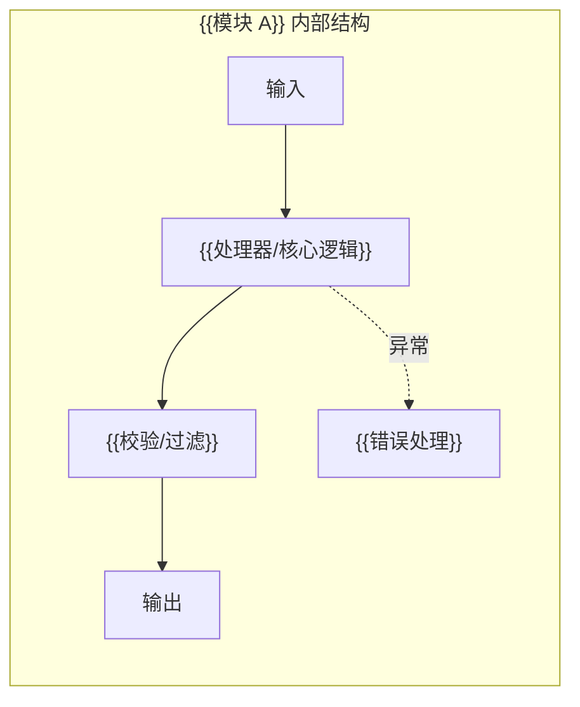
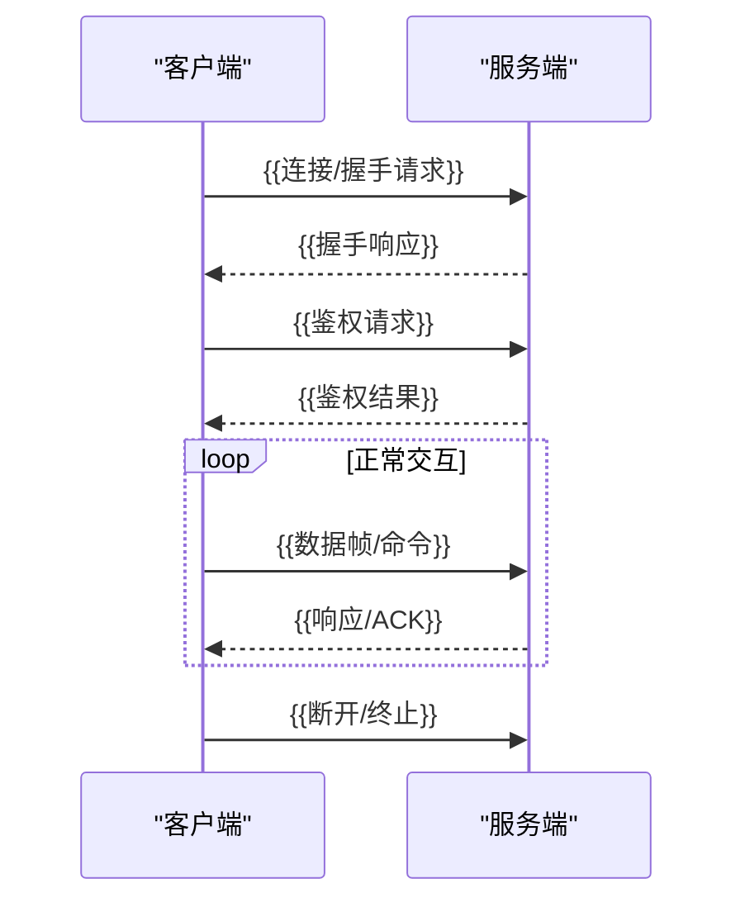
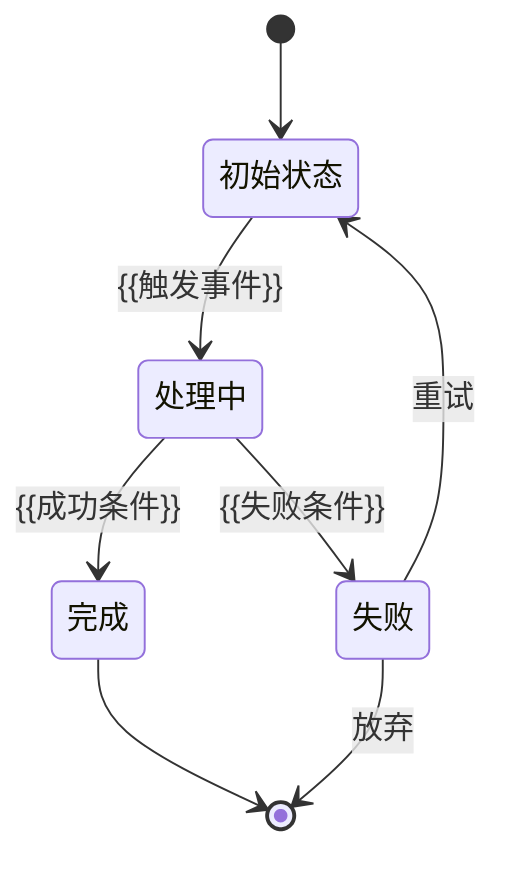
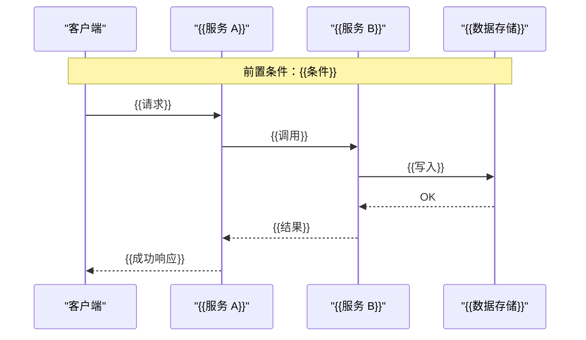
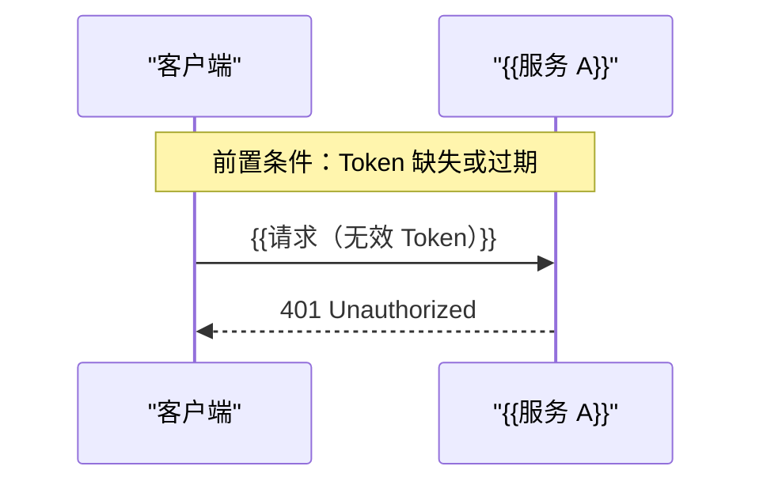
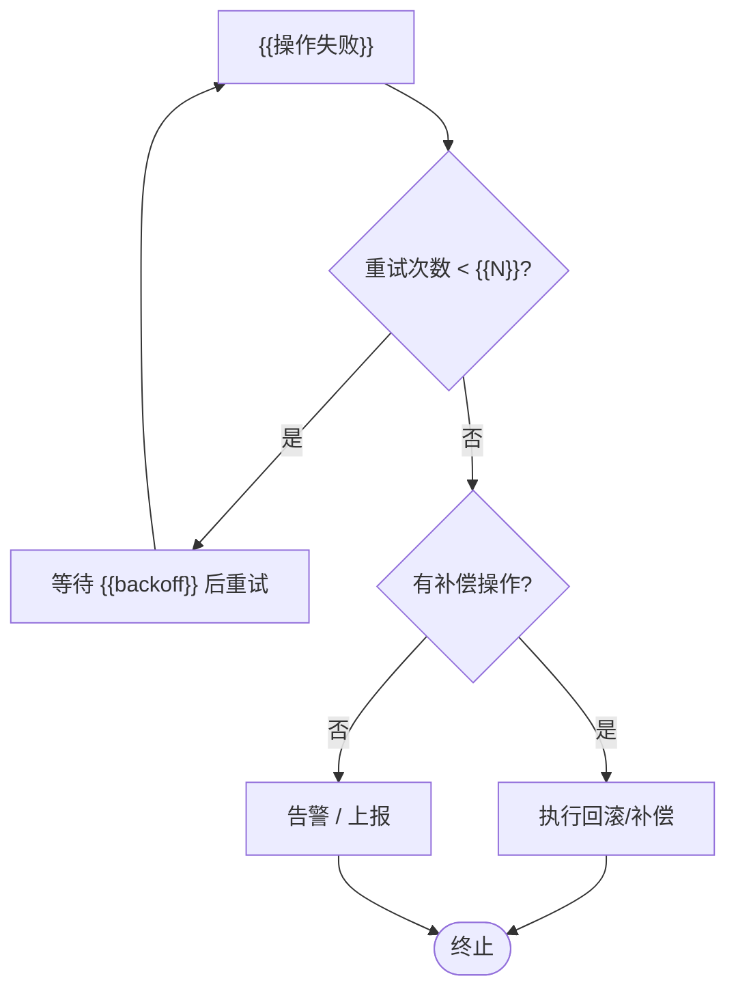
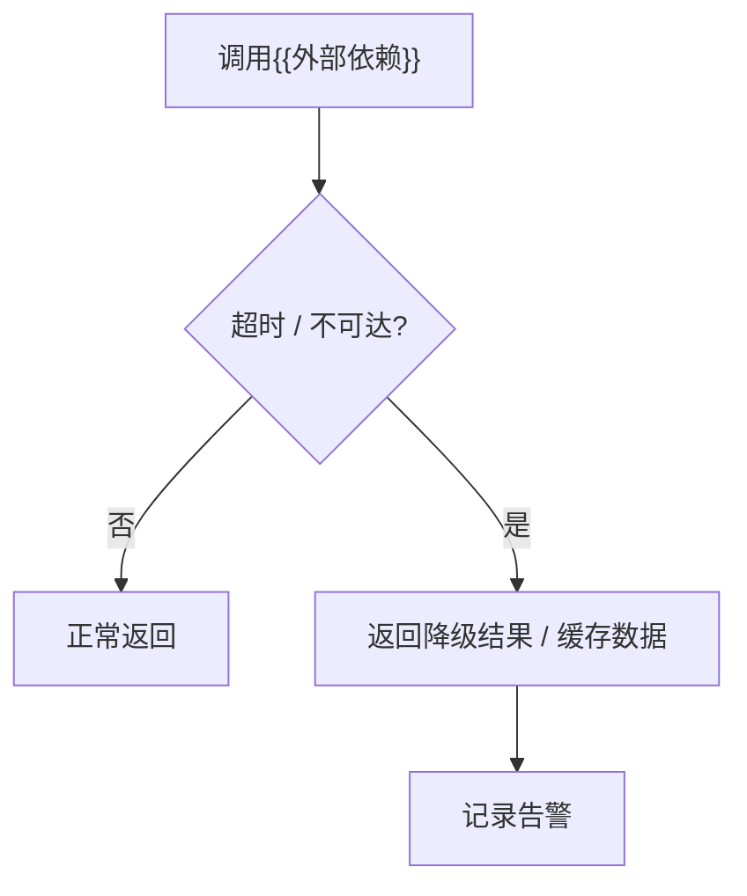

<div style="text-align: center; page-break-after: always; padding: 100px 40px; min-height: 80vh; display: flex; flex-direction: column; justify-content: center;">

# {{项目主题}} 详细设计

<br/><br/>

**版本：** {{版本号}}

</div>

# 文档目的

本文档在概要设计指导下，细化 {{项目主题}} 的模块内部设计、协议详细设计、API 说明、状态机流转、数据结构、异常处理和边界条件，为实现和测试提供可执行的设计依据。

# 适用读者

| 读者类型 | 关注点 |
| --- | --- |
| 开发人员 | 实现前所需的详细设计约束 |
| 架构 / 设计人员 | 详细设计与概要设计的一致性 |
| 测试人员 | 测试设计输入与异常路径依据 |
| 评审人员 | 实现可行性与设计完整性 |

# 修订记录

| 版本 | 日期 | 修订内容 | 撰写人 |
| --- | --- | --- | --- |
| {{版本号}} | {{日期}} | 初版创建 | {{撰写人}} |

# 目录

- [1. 详细设计范围](#1-详细设计范围)
- [2. 核心模块详细设计](#2-核心模块详细设计)
  - [2.1 模块 A](#21-模块-a)
  - [2.2 模块 B](#22-模块-b)
- [3. 协议详细设计](#3-协议详细设计)
  - [3.1 协议清单](#31-协议清单)
  - [3.2 协议帧 / 消息结构](#32-协议帧--消息结构)
  - [3.3 协议生命周期与状态](#33-协议生命周期与状态)
  - [3.4 协议错误与恢复](#34-协议错误与恢复)
  - [3.5 协议版本与兼容性](#35-协议版本与兼容性)
- [4. API 说明](#4-api-说明)
  - [4.1 API 总览](#41-api-总览)
  - [4.2 核心数据结构](#42-核心数据结构)
  - [4.3 API 详细说明](#43-api-详细说明)
    - [4.3.1 {{API 名称}}](#431-api-名称)
      - [4.3.1.1 函数原型](#4311-函数原型)
      - [4.3.1.2 输入说明](#4312-输入说明)
      - [4.3.1.3 输出 / 返回值说明](#4313-输出--返回值说明)
      - [4.3.1.4 使用限制](#4314-使用限制)
      - [4.3.1.5 调用示例](#4315-调用示例)
- [5. 状态机与时序设计](#5-状态机与时序设计)
  - [5.1 状态定义](#51-状态定义)
  - [5.2 状态流转](#52-状态流转)
  - [5.3 非法状态转换](#53-非法状态转换)
  - [5.4 关键时序流程](#54-关键时序流程)
    - [5.4.1 {{场景名称}}](#541-场景名称)
  - [5.5 失败与回退路径](#55-失败与回退路径)
    - [5.5.1 {{失败场景}}](#551-失败场景)
- [6. 数据模型详细设计](#6-数据模型详细设计)
  - [6.1 实体 / 对象模型](#61-实体--对象模型)
  - [6.2 字段级 Schema](#62-字段级-schema)
  - [6.3 对象关系](#63-对象关系)
  - [6.4 一致性与事务规则](#64-一致性与事务规则)
  - [6.5 迁移 / 回填 / 兼容性](#65-迁移--回填--兼容性)
- [7. 异常处理与边界条件](#7-异常处理与边界条件)
- [8. 可扩展性与维护说明](#8-可扩展性与维护说明)
  - [8.1 开放问题与阻塞项](#81-开放问题与阻塞项)
  - [8.2 设计充分性检查清单](#82-设计充分性检查清单)
- [9. 嵌入式约束详细设计（如适用）](#9-嵌入式约束详细设计如适用)
  - [9.1 数据类型规范](#91-数据类型规范)
  - [9.2 数据结构尺寸与对齐](#92-数据结构尺寸与对齐)
  - [9.3 栈深度与动态内存约束](#93-栈深度与动态内存约束)
  - [9.4 接口与编译约束](#94-接口与编译约束)

---

# 1. 详细设计范围

说明本文覆盖哪些功能模块、流程、协议、API、状态机和数据结构，以及不覆盖哪些内容。本文必须承接概要设计的功能模块、工作流程和详细设计下钻点，不得脱离概要设计另起设计边界。

# 2. 核心模块详细设计

## 2.1 模块 A

说明模块内部结构、职责分工、输入输出、处理逻辑和边界条件。



## 2.2 模块 B

说明模块内部结构、职责分工、输入输出、处理逻辑和边界条件。

# 3. 协议详细设计

当需求涉及通信协议、设备协议、协议栈、连接、会话、握手、编解码或消息帧时，本章为必填。协议详细设计与 API 说明分章描述。

## 3.1 协议清单

| ID | 协议名称 | 协议层级 | 参与方 | 传输方式 | 编码/帧格式 | 鉴权方式 | 版本 |
| --- | --- | --- | --- | --- | --- | --- | --- |
| P-01 | {{协议名称}} | {{层级}} | {{参与方}} | {{TCP/UDP/串口}} | {{二进制/JSON/TLV}} | {{方式}} | {{版本}} |

## 3.2 协议帧 / 消息结构

对每种协议帧、命令、事件或通知给出字段级定义：

| 字段 | 类型 | 必填 | 默认值 | 长度/范围 | 编码 | 示例 | 说明 |
| --- | --- | --- | --- | --- | --- | --- | --- |
| {{字段名}} | {{类型}} | 是/否 | {{默认值}} | {{范围}} | {{编码}} | {{示例}} | {{说明}} |

同时说明：帧边界、校验和/签名、压缩/加密、最大消息大小、消息顺序要求和重复消息处理。

## 3.3 协议生命周期与状态

说明初始化、握手、鉴权、正常交互、心跳/保活、重试/恢复、终止/清理和版本协商。



## 3.4 协议错误与恢复

| 错误码 | 错误名称 | 触发条件 | 是否可恢复 | 对端动作 | 本端动作 | 日志字段 |
| --- | --- | --- | --- | --- | --- | --- |
| {{错误码}} | {{名称}} | {{条件}} | 是/否 | {{动作}} | {{动作}} | {{字段}} |

## 3.5 协议版本与兼容性

说明当前版本、支持的历史版本、破坏性变更策略、版本协商机制和迁移计划。

# 4. API 说明

当需求涉及 REST/RPC/GraphQL、SDK 方法、Webhook、Callback、事件、消息队列或第三方集成时，本章为必填。本章与协议详细设计分章描述。

## 4.1 API 总览

| 序号 | 名称 | 类型 | 提供方 | 调用方/消费方 | 方法/消息 | 路径/主题/方法名 | 是否鉴权 | 是否幂等 | 版本 |
| --- | --- | --- | --- | --- | --- | --- | --- | --- | --- |
| 1 | {{API 名称}} | {{REST/RPC/SDK/事件}} | {{提供方}} | {{调用方}} | {{GET/POST/...}} | {{路径}} | 是/否 | 是/否 | {{版本}} |
| 2 | {{API 名称}} | {{REST/RPC/SDK/事件}} | {{提供方}} | {{调用方}} | {{GET/POST/...}} | {{路径}} | 是/否 | 是/否 | {{版本}} |

## 4.2 核心数据结构

列出本章 API 输入输出使用的核心 DTO/VO/Command/Event/Result 对象，字段级 Schema 见 §6.2。

```c
/* ============================================================
 * 示例：C 嵌入式结构体（按实际语言替换为对应语法）
 * 每个字段须注明：类型、取值范围、单位、与 API 序号的对应关系
 * ============================================================ */

/* 请求结构体 —— 对应 API 序号 1（{{API 名称}}）的输入参数 */
typedef struct {
    uint8_t  cmd_type;      /* 命令类型；取值：0x01=查询 0x02=写入 0x03=复位 */
    uint16_t target_id;     /* 目标节点 ID；范围：[1, 1023]；0 表示广播 */
    uint8_t  payload[16];   /* 有效载荷；长度固定 16 字节；未使用字节填 0x00 */
    uint8_t  checksum;      /* XOR 校验：cmd_type ^ target_id_lo ^ target_id_hi */
} {{RequestCmd_t}};         /* 替换为实际结构体名 */
_Static_assert(sizeof({{RequestCmd_t}}) == 20, "结构体大小不符合协议约定");

/* 响应结构体 —— 对应 API 序号 1 的输出，同时被 API 序号 2 复用 */
typedef struct {
    uint8_t  status;        /* 响应状态：0x00=成功 0x01=参数错误 0x02=超时 */
    uint16_t target_id;     /* 与请求 target_id 一致，用于关联匹配 */
    uint8_t  data[12];      /* 返回数据；含义随 cmd_type 变化，详见 §4.3 */
    uint32_t timestamp_ms;  /* 响应生成时间戳（ms），基于系统启动时间 */
} {{ResponseResult_t}};     /* 替换为实际结构体名 */
_Static_assert(sizeof({{ResponseResult_t}}) == 20, "结构体大小不符合协议约定");

/* 事件结构体 —— 由模块内部异步产生，通过消息队列上报（对应 API 序号 2）*/
typedef struct {
    uint8_t  event_id;      /* 事件类型：0x10=告警 0x11=状态变更 0x12=数据就绪 */
    uint16_t source_id;     /* 事件来源节点 ID */
    volatile uint8_t flags; /* ISR 与任务共享标志位；必须声明 volatile */
    uint8_t  reserved[2];   /* 显式 padding，保证 4 字节对齐；禁止使用 */
} {{EventMsg_t}};           /* 替换为实际结构体名 */
_Static_assert(sizeof({{EventMsg_t}}) == 6, "结构体大小不符合协议约定");
```

## 4.3 API 详细说明

每个 API 单独一个子章节（§4.3.1、§4.3.2 …），按 §4.1 总览顺序排列。

### 4.3.1 {{API 名称}}

{{简述本 API 的功能：做什么、由谁调用、触发时机、核心副作用（如有）。}}

#### 4.3.1.1 函数原型

```
{{返回类型}} {{方法名}}({{参数列表}})
```

| 项目 | 内容 |
| --- | --- |
| 序号 | 1 |
| 类型 | REST / RPC / SDK / Webhook / Event / Internal |
| 提供方 | {{模块/服务}} |
| 调用方 | {{模块/客户端}} |
| 方法/路径 | {{GET /api/v1/... / FunctionName}} |
| 鉴权 | {{Bearer Token / API Key / 无}} |
| 幂等性 | 是 / 否 |
| 版本 | {{v1}} |

#### 4.3.1.2 输入说明

| 参数/字段 | 位置 | 类型 | 必填 | 默认值 | 约束/取值范围 | 示例 | 说明 |
| --- | --- | --- | --- | --- | --- | --- | --- |
| {{字段}} | path/query/header/body | {{类型}} | 是/否 | {{默认}} | {{约束}} | {{示例}} | {{说明}} |

#### 4.3.1.3 输出 / 返回值说明

| 返回场景 | 状态码/结果码 | 字段 | 类型 | 约束 | 示例 | 说明 |
| --- | --- | --- | --- | --- | --- | --- |
| 成功 | 200 / OK | {{字段}} | {{类型}} | {{约束}} | {{示例}} | {{说明}} |
| 失败 | {{4xx/5xx/错误码}} | {{字段}} | {{类型}} | — | {{示例}} | {{触发条件}} |

错误码明细：

| 错误码 | 错误名称 | 触发条件 | 是否可重试 | 调用方动作 |
| --- | --- | --- | --- | --- |
| {{错误码}} | {{名称}} | {{条件}} | 是/否 | {{动作}} |

#### 4.3.1.4 使用限制

| 限制项 | 说明 |
| --- | --- |
| 调用频率 | {{QPS 上限 / 无限制}} |
| 并发安全 | {{线程安全 / 非线程安全 / 需加锁}} |
| 调用前置条件 | {{系统状态、依赖初始化、权限等}} |
| 禁止场景 | {{不得在中断中调用 / 不得重入 / …}} |
| 副作用 | {{写 DB / 发事件 / 修改全局状态 / 无}} |

#### 4.3.1.5 调用示例

**正常调用示例**

```bash
# 示例语言：curl（REST）/ C（SDK）/ Python / 按实际项目替换
#
# 场景：{{正常场景描述，例如：查询节点 ID=5 的传感器状态}}
# 前置条件：{{系统已初始化，目标节点在线}}

curl -X POST "https://{{host}}/api/v1/{{path}}" \
  -H "Authorization: Bearer {{token}}"  \  # 鉴权头；无鉴权时删除此行
  -H "Content-Type: application/json"   \
  -d '{
    "target_id": 5,          // 目标节点 ID；范围 [1, 1023]
    "cmd_type": "query",     // 命令类型；取值见 §4.2 核心数据结构
    "payload": "AAAAAAAAAAAAAAAA"  // Base64 编码，16 字节全零表示无附加参数
  }'

# 预期响应（HTTP 200）：
# {
#   "status": 0,             // 0 = 成功；非零见错误码表（§4.3.1.3）
#   "target_id": 5,          // 与请求 target_id 一致，用于关联
#   "data": "...",           // 返回数据；含义随 cmd_type 变化，详见 §4.3
#   "timestamp_ms": 123456   // 响应生成时间戳（ms），基于系统启动时间
# }
```

**边界 / 异常调用示例**

```bash
# 场景：{{异常场景描述，例如：target_id 超出范围，触发参数校验错误}}
# 目的：验证调用方收到 0x01 错误码后是否按 §4.3.1.3 描述执行重试/告警

curl -X POST "https://{{host}}/api/v1/{{path}}" \
  -H "Authorization: Bearer {{token}}"  \
  -H "Content-Type: application/json"   \
  -d '{
    "target_id": 9999,       // 非法值：超出 [1, 1023] 范围
    "cmd_type": "query",
    "payload": "AAAAAAAAAAAAAAAA"
  }'

# 预期响应（HTTP 400）：
# {
#   "status": 1,             // 0x01 = 参数错误
#   "error": "INVALID_TARGET_ID",
#   "message": "target_id must be in [1, 1023]"
# }
# 调用方动作：记录日志，不重试，上报告警（见 §4.3.1.4 禁止场景）
```

# 5. 状态机与时序设计

## 5.1 状态定义

| 状态 | 含义 | 归属方 | 进入条件 | 退出条件 | 是否持久化 |
| --- | --- | --- | --- | --- | --- |
| {{状态名}} | {{含义}} | {{模块}} | {{条件}} | {{条件}} | 是/否 |



## 5.2 状态流转

| 来源状态 | 事件/触发器 | Guard 条件 | 目标状态 | 动作 | 失败流转 |
| --- | --- | --- | --- | --- | --- |
| {{来源状态}} | {{事件}} | {{条件}} | {{目标状态}} | {{动作}} | {{失败处理}} |

每个状态至少有一个合法退出路径，除非明确标记为终态。

## 5.3 非法状态转换

| 当前状态 | 非法事件 | 预期处理 | 错误码/结果 |
| --- | --- | --- | --- |
| {{状态}} | {{非法事件}} | {{拒绝/忽略/报错}} | {{错误码}} |

## 5.4 关键时序流程

对每个关键场景单独一个子章节，每节包含一张时序图。每张图至少包含：参与方、前置条件（Note）、有序步骤、成功结果和失败分支。

常见必需场景：正常路径、鉴权/权限失败、输入校验失败、超时/重试、重复/重放请求、外部依赖不可用、取消/回滚/清理。

### 5.4.1 {{场景名称，如：正常请求处理流}}



### 5.4.2 {{场景名称，如：鉴权失败流}}

> 按需添加子章节，每个关键场景一节。



## 5.5 失败与回退路径

每种失败模式单独一个子章节，说明重试机制、补偿机制、超时处理和清理逻辑。

### 5.5.1 {{失败场景，如：操作失败重试与补偿}}



### 5.5.2 {{失败场景，如：外部依赖不可用降级}}

> 按需添加子章节，每种失败模式一节。



# 6. 数据模型详细设计

## 6.1 实体 / 对象模型

| 对象 | 目的 | 归属模块 | 是否持久化 | 生命周期 |
| --- | --- | --- | --- | --- |
| {{对象名}} | {{用途}} | {{模块}} | 是/否 | {{生命周期描述}} |

## 6.2 字段级 Schema

对每个对象给出字段级定义：

| 字段 | 类型 | 必填 | 可空 | 默认值 | 约束 | 索引/键 | 示例 |
| --- | --- | --- | --- | --- | --- | --- | --- |
| {{字段名}} | {{类型}} | 是/否 | 是/否 | {{默认}} | {{约束}} | PK/FK/INDEX | {{示例}} |

## 6.3 对象关系

| 源对象 | 关系 | 目标对象 | 基数 | 删除/更新行为 |
| --- | --- | --- | --- | --- |
| {{对象 A}} | {{has_many/belongs_to/...}} | {{对象 B}} | 1:N | {{CASCADE/SET_NULL/...}} |

## 6.4 一致性与事务规则

| 规则 | 影响对象 | 执行位置 | 失败行为 |
| --- | --- | --- | --- |
| {{规则描述}} | {{对象}} | {{DB/应用层/分布式事务}} | {{回滚/补偿/忽略}} |

## 6.5 迁移 / 回填 / 兼容性

当既有数据受影响时，说明：Schema 变化、迁移步骤、回滚计划、回填策略和兼容期。

# 7. 异常处理与边界条件

列出重要异常输入、外部依赖异常、超时失败和边界情况的处理方式。

对于工作机制（重试、补偿、调度、同步），说明：
- **触发条件**：何时触发该机制
- **核心步骤**：执行步骤和顺序
- **关键规则**：超时时间、重试次数、退避策略
- **失败处理**：机制本身失败时的处理方式
- **退出条件**：何时终止机制

| 异常/边界 | 触发条件 | 处理方式 | 重试性 | 日志/告警 |
| --- | --- | --- | --- | --- |
| {{异常名称}} | {{触发条件}} | {{处理方式}} | 是/否 | {{日志级别}} |

# 8. 可扩展性与维护说明

说明后续扩展点、兼容性考虑和维护注意事项。

## 8.1 开放问题与阻塞项

| ID | 问题/未知项 | 影响章节 | 负责人 | 是否阻塞实现 | 需要的决策 |
| --- | --- | --- | --- | --- | --- |
| OQ-01 | {{问题描述}} | {{章节}} | {{负责人}} | 是/否 | {{需要的决策}} |

不得在协议、API、数据、错误码、状态流转章节中留下未登记的 TBD/待确认/后续补充。阻塞项未解决前不能通过 Baseline Docs Gate。

## 8.2 设计充分性检查清单

> **此节仅供 AI 写文档时自检使用，文档通过 Baseline Docs Gate 后必须删除本节。**

- [ ] 本文档已承接概要设计的功能模块、工作流程和详细设计下钻点。
- [ ] 协议详细设计和 API 说明已分章描述。
- [ ] 所有协议列出了名称、层级、参与方、传输方式、编码格式、鉴权方式和版本。
- [ ] 所有 API 列出了提供方、调用方、方法、路径、鉴权、幂等、版本和用途。
- [ ] API 说明先给出清单和核心数据结构，再按每个 API 单独展开。
- [ ] 每个 API 写清楚输入、输出/返回值、错误返回、调用示例和测试要点。
- [ ] 所有协议帧、API 输入/输出包含字段、类型、必填性、约束和示例。
- [ ] 所有重要错误有错误码、触发条件、可重试性和调用方动作。
- [ ] 所有有状态行为有状态定义、流转表和状态图。
- [ ] 所有关键流程有有序步骤或时序图。
- [ ] 所有数据模型有字段级定义和一致性约束。
- [ ] 所有重试、超时、幂等、回滚/补偿行为在适用场景下已定义。
- [ ] 安全边界和验证方式在涉及鉴权、用户输入、外部集成或持久化时已定义。
- [ ] 所有未知项已列入开放问题表并标明是否阻塞实现。
- [ ] 本文档包含足够信息支撑任务编排和 TDD 实现。
- [ ] **（嵌入式）** §9.1 已列出所有跨模块接口字段的精确宽度类型（`uint8_t`/`uint16_t`/`uint32_t` 等），禁止使用 `int`/`long`。
- [ ] **（嵌入式）** §9.2 每个关键结构体有 `sizeof()` 静态断言或注释，并与概要设计 §6.3 预算一致。
- [ ] **（嵌入式）** §9.3 列出每个任务/中断的栈深度和峰值路径分析。
- [ ] **（嵌入式）** §9.4 已声明浮点使用规则、禁止递归、字节序和 Packing 约束。

# 9. 嵌入式约束详细设计（如适用）

> 非嵌入式项目可删除本节。本节内容必须与概要设计 §3.5 和 §6.3 保持一致；超出预算须在 §8.1 登记阻塞项。

## 9.1 数据类型规范

所有跨模块接口、协议字段、寄存器映射和持久化数据必须使用 `<stdint.h>` 精确宽度类型。

| 场景 | 允许类型 | 禁止类型 | 说明 |
| --- | --- | --- | --- |
| 接口字段（协议/API/消息） | `uint8_t`, `uint16_t`, `uint32_t`, `uint64_t`, `int8_t`, `int16_t`, `int32_t` | `int`, `long`, `short`, `char`（用于数值时） | 平台无关，字宽明确 |
| 布尔标志 | `uint8_t`（0/1） | `bool`（可移植性差） | 避免不同编译器对 `bool` 大小的不一致 |
| 寄存器映射字段 | `volatile uint8_t`/`uint16_t`/`uint32_t` | 非 volatile 类型 | 防止编译器优化掉寄存器访问 |
| 枚举底层类型 | `uint8_t` 或 `uint16_t`（显式 typedef） | 默认 `int` 枚举 | 嵌入式枚举用 typedef + 宏定义确保宽度 |
| 定点数（无 FPU） | `int16_t`（Q15）/ `int32_t`（Q31） | `float`, `double` | 如有 FPU 可在指定模块使用 float，须在 §9.4 声明 |

## 9.2 数据结构尺寸与对齐

每个关键结构体必须提供 `sizeof()` 注释，并与概要设计 §6.3.1 RAM 预算一致。

| 结构体名称 | 归属模块 | sizeof (字节) | 静态断言 | 对齐要求 | Packing | 说明 |
| --- | --- | --- | --- | --- | --- | --- |
| `{{Struct_A}}` | M-01 | {{N}} | `_Static_assert(sizeof(Struct_A)==N, "")` | {{1/2/4 字节}} | {{是/否}} | {{主要字段说明}} |
| `{{Struct_B}}` | M-02 | {{N}} | `_Static_assert(sizeof(Struct_B)==N, "")` | {{1/2/4 字节}} | {{是/否}} | {{主要字段说明}} |

**Packing 规则**：协议帧结构体必须使用 `__attribute__((packed))`；内存内部结构体按降序字段排列（大字段在前）以减少 padding。

## 9.3 栈深度与动态内存约束

### 9.3.1 任务栈深度

| 任务 / 中断名称 | 栈预算 (字节) | 峰值调用路径 | 验证方式 | 与 §6.3.2 一致 |
| --- | --- | --- | --- | --- |
| `{{Task_Main}}` | {{N}} | `{{func_a → func_b → func_c}}` | StackAnalyzer / 手动计算 | 是/否 |
| `{{ISR_Ext}}` | {{N}} | `{{isr_handler → process_data}}` | 手动计算 | 是/否 |

**峰值路径说明**：列出从任务入口到最深调用栈的完整函数链，每个函数注明局部变量大小。

### 9.3.2 动态内存约束

| 规则 | 说明 |
| --- | --- |
| 运行时禁止 `malloc`/`free` | 运行时动态分配导致堆碎片化，嵌入式系统不可接受 |
| 初始化阶段例外 | 系统启动阶段（`main()` 前或初始化函数内）允许一次性分配，分配后地址固定不释放 |
| 缓冲区大小 | 所有缓冲区在编译期以宏或 `static` 数组定义；不得依赖运行时参数决定大小 |
| 静态内存池（如有） | 若需要动态行为，使用固定大小内存池（静态数组 + 空闲链表），不使用系统堆 |

## 9.4 接口与编译约束

| 约束项 | 规则 | 违规后果 |
| --- | --- | --- |
| 浮点运算 | {{禁止 / 仅限模块 M-XX（含 FPU）}} | 无 FPU 时编译器生成软浮点库，Code size 激增 |
| 递归函数 | 全部禁止；深度不确定算法用迭代 + 固定大小栈替代 | 栈溢出，调试极难 |
| 字节序 | 协议/网络字段统一大端；内存字段遵从目标 MCU（{{小端/大端}}） | 字节序混乱导致数据解析错误 |
| 编译警告 | 所有代码以 `-Wall -Wextra -Werror` 编译无警告 | 隐性 bug 难以定位 |
| 隐式类型转换 | 禁止；所有截断转换使用显式强制类型转换 | 宽度缩减导致数据丢失 |
| 全局变量 | 跨模块共享状态通过接口函数访问，禁止直接暴露全局变量 | 破坏模块边界，RAM 布局难以管理 |
| `volatile` 使用 | 所有被 ISR 和主程序共享的变量必须声明 `volatile` | 编译器优化导致状态不可见 |
