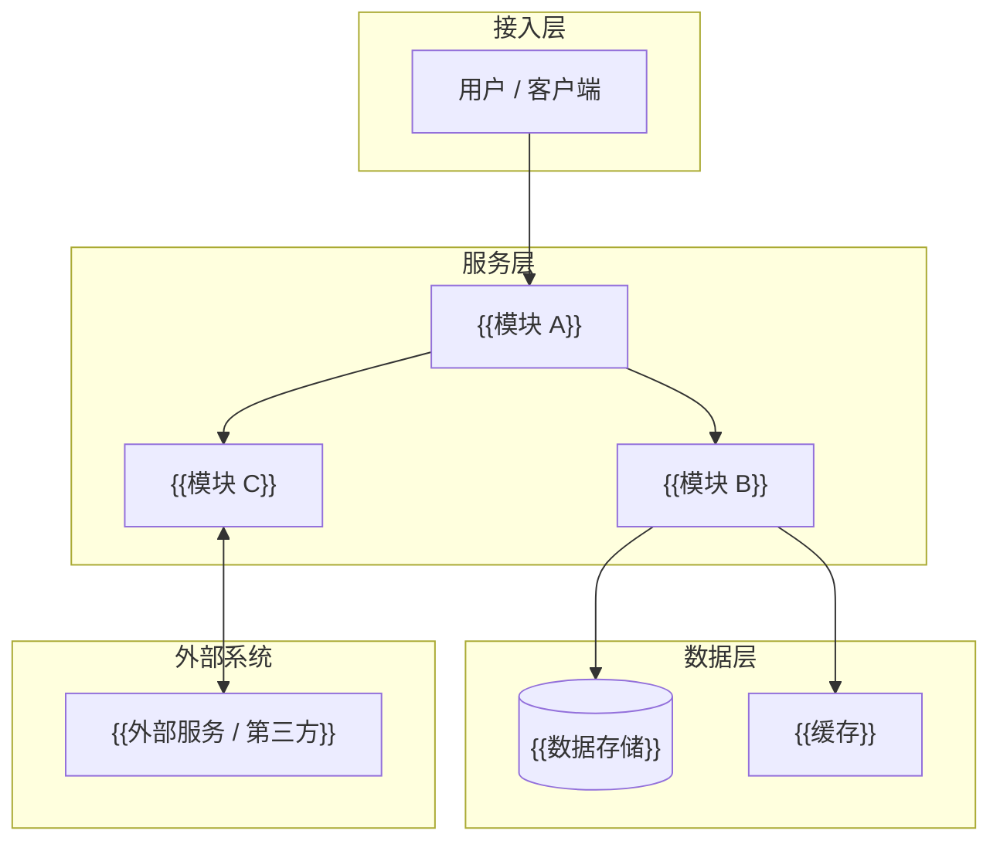
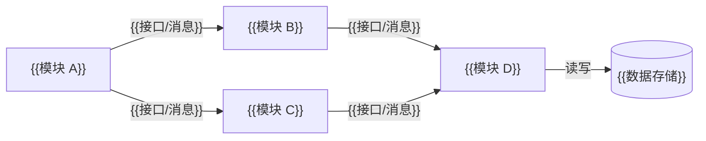
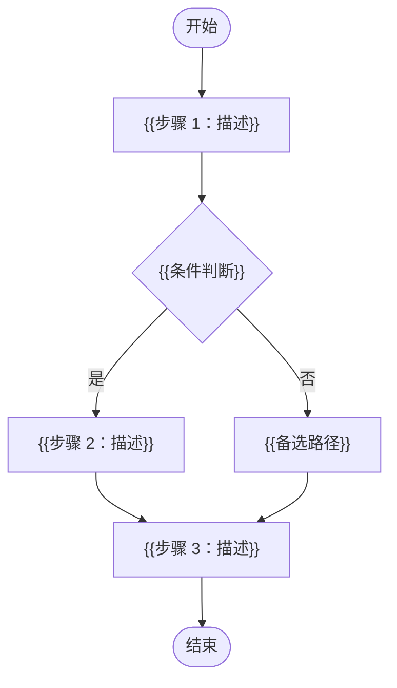
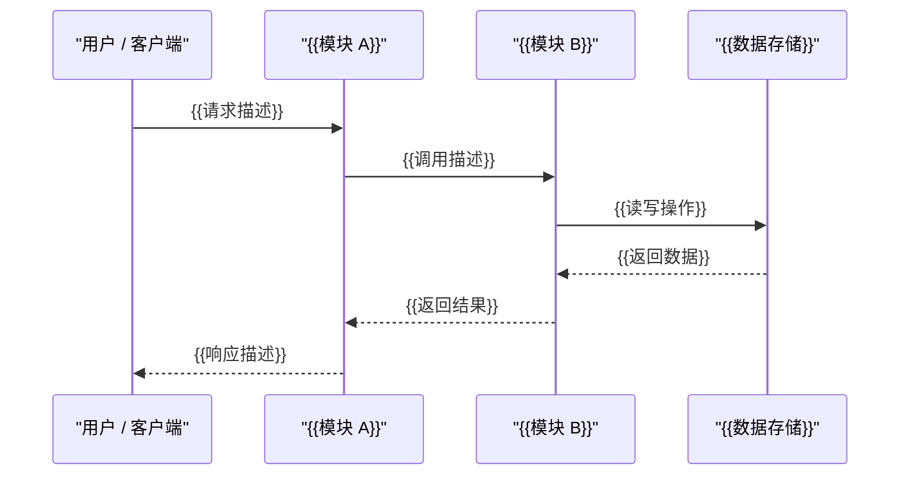
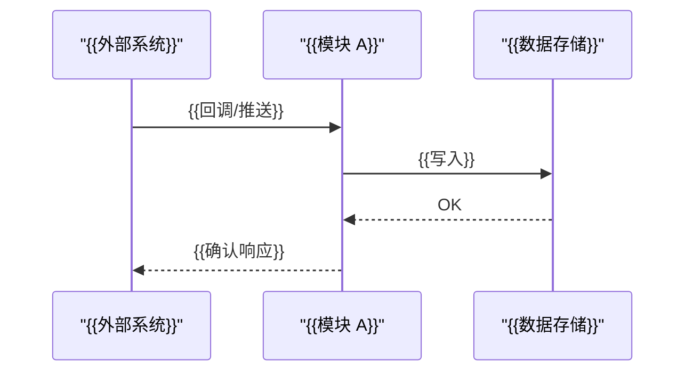
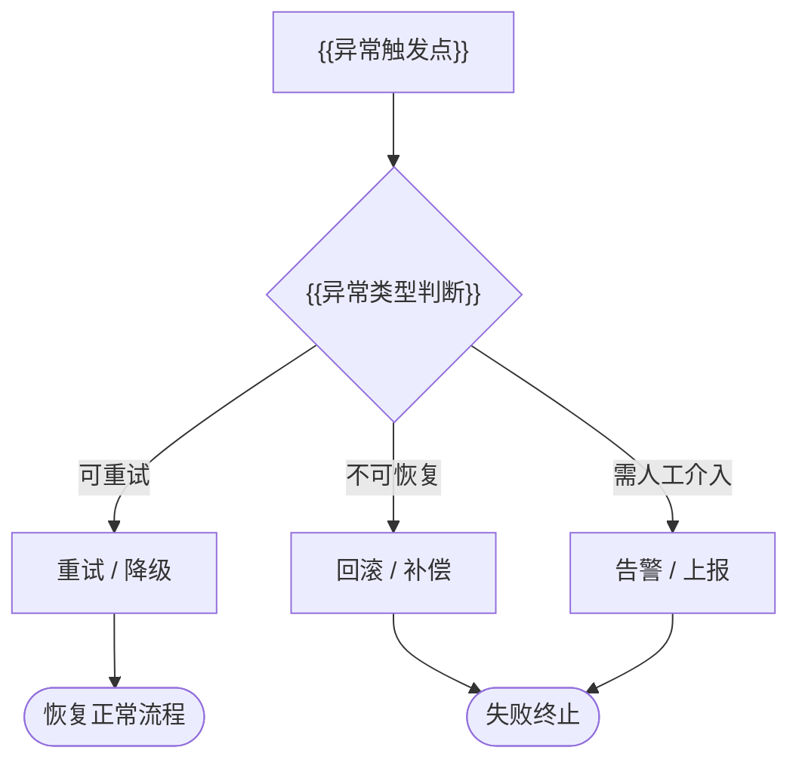
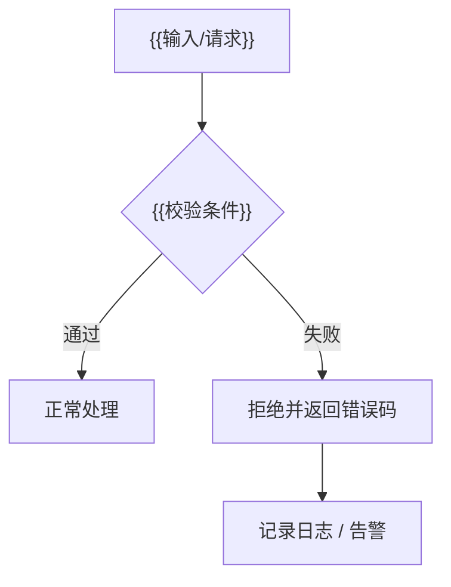

# {{项目主题}} 概要设计

  

**版本：** {{版本号}}

# 文档目的

本文档描述 {{项目主题}} 的总体设计方案、功能模块划分、工作流程、数据与边界概览及关键技术选型，作为详细设计和任务编排的上层依据。协议帧、API 合同、字段级 Schema、错误码和状态机细节在详细设计中展开。

# 适用读者

| 读者类型 | 关注点 |
| --- | --- |
| 架构 / 设计人员 | 总体方案、模块边界、技术路线 |
| 开发人员 | 系统整体结构、关键流程 |
| 测试人员 | 系统边界、主要验证方向 |
| 项目负责人 / 评审人员 | 方案合理性、可交付性 |

# 修订记录

| 版本 | 日期 | 修订内容 | 撰写人 |
| --- | --- | --- | --- |
| {{版本号}} | {{日期}} | 初版创建 | {{撰写人}} |

# 目录

- [1. 设计目标](#1-设计目标)
- [2. 总体架构](#2-总体架构)
  - [2.1 分层说明](#21-分层说明)
  - [2.2 设计边界](#22-设计边界)
  - [2.3 关键数据流](#23-关键数据流)
- [3. 模块划分](#3-模块划分)
  - [3.1 模块清单](#31-模块清单)
  - [3.2 模块职责](#32-模块职责)
  - [3.3 模块间关系](#33-模块间关系)
- [4. 功能设计](#4-功能设计)
  - [4.1 功能清单](#41-功能清单)
  - [4.2 功能模块职责](#42-功能模块职责)
  - [4.3 功能依赖关系](#43-功能依赖关系)
- [5. 工作流程设计](#5-工作流程设计)
  - [5.1 主流程](#51-主流程)
  - [5.2 关键交互流程](#52-关键交互流程)
    - [5.2.1 {{场景名称}}](#521-场景名称)
  - [5.3 异常流程概述](#53-异常流程概述)
    - [5.3.1 {{异常类型}}](#531-异常类型)
  - [5.4 详细设计下钻点](#54-详细设计下钻点)
- [6. 数据与边界概览](#6-数据与边界概览)
  - [6.1 核心数据对象](#61-核心数据对象)
  - [6.2 内部边界说明](#62-内部边界说明)
  - [6.3 资源预算（嵌入式，如适用）](#63-资源预算嵌入式如适用)
- [7. 技术选型与权衡](#7-技术选型与权衡)
  - [7.1 技术栈选择](#71-技术栈选择)
  - [7.2 技术选型权衡](#72-技术选型权衡)
  - [7.3 决策依据与 ADR](#73-决策依据与-adr)
- [8. 风险与限制](#8-风险与限制)
  - [8.1 开放问题与阻塞项](#81-开放问题与阻塞项)
  - [8.2 设计充分性检查清单](#82-设计充分性检查清单)

---

# 1. 设计目标

说明总体设计目标、设计原则及与需求分析的对应关系。

# 2. 总体架构

## 2.1 分层说明

| 层级 | 包含组件 | 职责 | 对外接口 |
| --- | --- | --- | --- |
| 接入层 | {{用户/客户端}} | {{请求入口，负责协议适配、鉴权和流量控制}} | {{HTTP/WebSocket/串口/…}} |
| 服务层 | {{模块 A、模块 B、模块 C}} | {{核心业务逻辑，处理功能请求并协调数据层}} | {{内部调用/消息/RPC}} |
| 数据层 | {{数据存储、缓存}} | {{持久化存储和高速缓存，不包含业务逻辑}} | {{SQL/KV/文件}} |
| 外部系统 | {{外部服务/第三方}} | {{系统边界外的依赖，通过适配层解耦}} | {{REST/SDK/协议}} |

## 2.2 设计边界

| 边界项 | 说明 |
| --- | --- |
| 系统职责范围 | {{本系统负责的功能边界；明确哪些能力由本系统提供}} |
| 系统外部依赖 | {{依赖哪些外部系统/服务；依赖关系是同步还是异步}} |
| 不在本系统范围 | {{明确排除项：哪些功能不由本系统实现，由谁负责}} |
| 部署边界 | {{单进程/微服务/固件；部署单元划分}} |

## 2.3 关键数据流

描述主要业务场景下数据从入口到存储的完整流向，帮助理解架构中各层的协作方式。

| 场景 | 数据流向 | 关键经过节点 |
| --- | --- | --- |
| {{主业务流程}} | 接入层 → {{模块 A}} → {{模块 B}} → 数据层 | {{关键处理点}} |
| {{外部集成流程}} | {{模块 C}} ↔ 外部系统 → {{模块 B}} → 数据层 | {{适配/转换点}} |

# 3. 模块划分

## 3.1 模块清单

| 模块 ID | 模块名称 | 类型 | 说明 |
| --- | --- | --- | --- |
| M-01 | {{模块名称}} | {{服务/库/组件}} | {{职责简述}} |
| M-02 | {{模块名称}} | {{服务/库/组件}} | {{职责简述}} |

## 3.2 模块职责

| 模块 | 职责 | 输入 | 输出 | 不负责 |
| --- | --- | --- | --- | --- |
| {{模块 A}} | {{职责描述}} | {{输入来源}} | {{输出目标}} | {{明确排除项}} |
| {{模块 B}} | {{职责描述}} | {{输入来源}} | {{输出目标}} | {{明确排除项}} |

## 3.3 模块间关系

说明模块之间的依赖方向和交互方式。

# 4. 功能设计

本章说明系统由哪些功能能力组成、各功能的职责边界及功能间协作关系。字段级 API、协议帧和状态机细节在详细设计展开。

## 4.1 功能清单

| 功能 ID | 功能名称 | 目标 | 主要输入 | 主要输出 | 涉及模块 |
| --- | --- | --- | --- | --- | --- |
| F-01 | {{功能名称}} | {{目标}} | {{输入}} | {{输出}} | {{模块}} |
| F-02 | {{功能名称}} | {{目标}} | {{输入}} | {{输出}} | {{模块}} |

## 4.2 功能模块职责

说明各功能模块的职责、边界和不负责的事项。

## 4.3 功能依赖关系

说明功能之间的依赖、调用顺序和主要协作关系。

# 5. 工作流程设计

## 5.1 主流程

描述核心业务主流程，说明关键步骤、参与方和主路径。

## 5.2 关键交互流程

描述跨模块、跨角色或跨系统的关键交互链路。每个独立场景单独一个子章节，每个子章节包含一张时序图。

### 5.2.1 {{场景名称，如：核心业务请求流}}

### 5.2.2 {{场景名称，如：外部集成回调流}}

> 按需添加子章节，每个关键链路一节。

## 5.3 异常流程概述

描述重要异常路径的总体处理方式。每种异常类型单独一个子章节。

### 5.3.1 {{异常类型，如：服务不可用 / 超时重试}}

### 5.3.2 {{异常类型，如：数据校验失败 / 权限拒绝}}

> 按需添加子章节，每种异常处理模式一节。

## 5.4 详细设计下钻点

列出需在详细设计中继续展开的设计点。

| 下钻点 | 来源功能/流程 | 需要详细设计展开的内容 | 是否阻塞实现 |
| --- | --- | --- | --- |
| {{下钻点描述}} | {{F-0X / 主流程}} | {{协议帧/API/状态机/错误码/数据字段}} | 是 / 否 |

# 6. 数据与边界概览

## 6.1 核心数据对象

| 对象 | 含义 | 生命周期 | 归属模块 |
| --- | --- | --- | --- |
| {{对象名称}} | {{含义}} | {{生命周期}} | {{模块}} |

## 6.2 内部边界说明

说明内部模块边界、功能边界及详细设计需要承接的 API 责任。协议帧、API 字段、错误码和状态机在详细设计展开。

## 6.3 资源预算（嵌入式，如适用）

> 非嵌入式项目可删除本节。资源预算必须在概要设计阶段按模块确定，详细设计和实现须严格遵守；超出预算需变更评审。

### 6.3.1 模块级资源预算

| 模块 ID | 模块名称 | RAM 预算 (字节) | Stack 预算 (字节) | Code/Flash 预算 (字节) | 说明 / 主要数据结构 |
| --- | --- | --- | --- | --- | --- |
| M-01 | {{模块名称}} | ≤ {{N}} | ≤ {{N}} | ≤ {{N}} | {{主要占用来源}} |
| M-02 | {{模块名称}} | ≤ {{N}} | ≤ {{N}} | ≤ {{N}} | {{主要占用来源}} |
| **合计** | — | ≤ **{{Total}}** | ≤ **{{Total}}** | ≤ **{{Total}}** | 含系统框架和中断开销 |
| **系统上限** | — | {{系统 RAM 总量}} KB | {{Stack 分配总量}} KB | {{Flash 总量}} KB | 来自需求 §3.5.2 |

### 6.3.2 任务 / 中断栈深度

| 任务 / 中断名称 | 优先级 | 栈深度 (字节) | 触发方式 | 说明 |
| --- | --- | --- | --- | --- |
| {{Task_Main}} | {{数字}} | {{N}} | 周期 / 事件 | {{说明}} |
| {{ISR_Ext}} | — | {{N}} | 外部中断 | {{说明}} |

### 6.3.3 资源约束说明

- 禁止运行时动态内存分配（`malloc`/`free`）；所有缓冲区在编译时确定大小。
- 详细设计必须为每个模块提供 `sizeof()` 注释或静态断言，确保结构体大小符合预算。
- 实现阶段通过 Linker Map 文件和栈深度分析工具验证，验证结果记入测试方案 §3.6。

# 7. 技术选型与权衡

对于新项目或技术栈未定的工作，本章必须先完成技术栈选择，不能将"技术栈待定"留到详细设计或实现阶段。

## 7.1 技术栈选择

覆盖前端、后端、数据库、缓存、消息队列、部署环境、测试框架、监控日志等适用领域。

| 层级 / 领域 | 选择 | 备选方案 | 选择理由 | 主要风险 | 对详细设计的影响 |
| --- | --- | --- | --- | --- | --- |
| {{层级}} | {{选择}} | {{备选}} | {{理由}} | {{风险}} | {{影响}} |

## 7.2 技术选型权衡

| 决策项 | 方案 A | 方案 B | 取舍结论 | 约束 / 假设 |
| --- | --- | --- | --- | --- |
| {{决策项}} | {{方案 A}} | {{方案 B}} | {{结论}} | {{约束}} |

技术栈未定项必须登记到开放问题，阻塞详细设计的问题未解决前不应进入详细设计定稿。

## 7.3 决策依据与 ADR

重大技术选择必须记录依据来源。涉及新框架、新库、第三方集成、协议、API 边界、安全/性能关键路径时，应记录是否需要单独 ADR。

| 决策项 | 依据来源（官方文档/源码/现有项目模式） | 备选方案 | 选择理由 | 是否需要 ADR | 影响范围 |
| --- | --- | --- | --- | --- | --- |
| {{决策项}} | {{依据来源}} | {{备选}} | {{理由}} | 是 / 否 | {{范围}} |

# 8. 风险与限制

## 8.1 开放问题与阻塞项

| ID | 问题 / 未知项 | 影响章节 | 负责人 | 是否阻塞实现 | 需要的决策 |
| --- | --- | --- | --- | --- | --- |
| OQ-01 | {{问题描述}} | {{章节}} | {{负责人}} | 是 / 否 | {{需要的决策}} |

阻塞项未解决前，不应进入任务编排。

## 8.2 设计充分性检查清单

> **此节仅供 AI 写文档时自检使用，文档通过 Baseline Docs Gate 后必须删除本节。**

- [ ] 功能模块、职责边界和功能依赖关系已说明。
- [ ] 总体架构图已包含系统分层、主要模块和外部依赖。
- [ ] 模块间关系图已说明依赖方向和交互方式。
- [ ] 主流程、关键交互流程和异常流程已包含 Mermaid 图示。
- [ ] 需要在详细设计中展开的下钻点已完整列出。
- [ ] 新项目或技术栈未定场景下，技术栈选择、备选方案、选择理由和主要风险已说明。
- [ ] 关键技术选择已记录依据来源；需要 ADR 的决策已标记。
- [ ] 所有版本、兼容性、迁移或废弃策略在适用场景下已说明。
- [ ] 所有阻塞性开放问题已解决，或已被用户明确接受为风险。
- [ ] 本文档提供的信息足以指导详细设计，不需要详细设计自行推翻功能和流程边界。
- [ ] **（嵌入式）** §6.3 资源预算表已按模块分配 RAM/Stack/Code 预算，并与需求 §3.5.2 上限一致。
- [ ] **（嵌入式）** 任务/中断栈深度表已列出所有任务和中断的栈预算。
- [ ] **（嵌入式）** 资源约束说明已声明禁止运行时动态内存分配。
