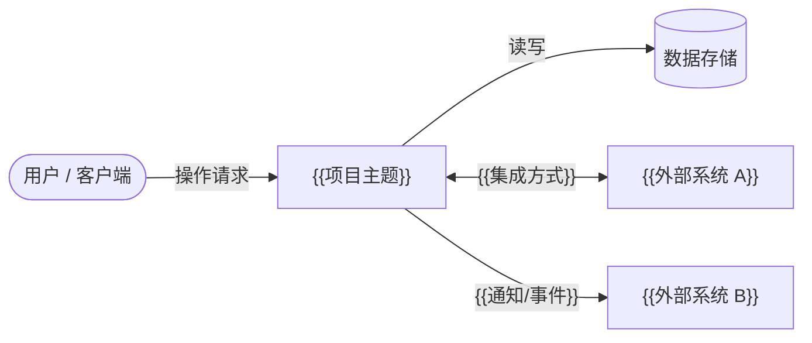

# {{项目主题}} 需求基线文档

  

**版本：** {{版本号}}

# 文档目的

本文档描述 {{项目主题}} 的需求背景、目标范围、用户场景、功能需求、非功能需求及验收标准，作为概要设计、详细设计、测试方案和 Loop Phase DAG 的需求基线。

# 适用读者

| 读者类型 | 关注点 |
| --- | --- |
| 产品 / 项目负责人 | 需求范围、优先级、交付目标 |
| 架构 / 设计人员 | 需求基线输入、约束边界 |
| 开发人员 | 功能需求、非功能约束 |
| 测试人员 | 测试设计输入、验收边界 |

# 修订记录

| 版本 | 日期 | 修订内容 | 撰写人 |
| --- | --- | --- | --- |
| {{版本号}} | {{日期}} | 初版创建 | {{撰写人}} |

# 目录

- [1. 引言](#1-引言)
  - [1.1 项目背景](#11-项目背景)
  - [1.2 项目目标](#12-项目目标)
  - [1.3 目标用户](#13-目标用户)
- [2. 系统概述](#2-系统概述)
  - [2.1 系统简介](#21-系统简介)
  - [2.2 系统边界](#22-系统边界)
  - [2.3 使用场景](#23-使用场景)
- [3. 需求说明](#3-需求说明)
  - [3.1 功能需求](#31-功能需求)
  - [3.2 业务规则](#32-业务规则)
  - [3.3 数据与接口需求](#33-数据与接口需求)
  - [3.4 非功能需求](#34-非功能需求)
  - [3.5 嵌入式资源约束（如适用）](#35-嵌入式资源约束如适用)
- [4. 约束与风险](#4-约束与风险)
  - [4.1 约束条件](#41-约束条件)
  - [4.2 依赖条件](#42-依赖条件)
  - [4.3 风险与假设](#43-风险与假设)
- [5. 验收标准](#5-验收标准)
  - [5.1 功能验收标准](#51-功能验收标准)
  - [5.2 非功能验收标准](#52-非功能验收标准)
  - [5.3 交付边界](#53-交付边界)

---

# 1. 引言

## 1.1 项目背景

说明该项目/需求产生的背景、当前问题、触发原因和业务环境。

## 1.2 项目目标

说明希望达成的目标和预期收益。

## 1.3 目标用户

| 用户类型 | 使用目的 | 关键诉求 |
| --- | --- | --- |
| {{用户类型 A}} | {{使用目的}} | {{关键诉求}} |
| {{用户类型 B}} | {{使用目的}} | {{关键诉求}} |

# 2. 系统概述

## 2.1 系统简介

说明该系统是什么，在整体系统中承担的角色。

## 2.2 系统边界

说明系统边界、模块边界及与外部系统的关系。

## 2.3 使用场景

描述系统的典型使用场景，说明参与角色和主要操作链路。

| 场景 ID | 场景名称 | 参与角色 | 场景描述 |
| --- | --- | --- | --- |
| UC-01 | {{场景名称}} | {{角色}} | {{描述}} |
| UC-02 | {{场景名称}} | {{角色}} | {{描述}} |

# 3. 需求说明

## 3.1 功能需求

| 功能域 | 需求说明 |
| --- | --- |
| {{功能域 A}} | {{需求描述}} |
| {{功能域 B}} | {{需求描述}} |
| {{功能域 C}} | {{需求描述}} |

## 3.2 业务规则

| 规则类型 | 规则说明 |
| --- | --- |
| 状态流转规则 | {{示例：仅当状态为 A 时允许进入状态 B}} |
| 权限规则 | {{示例：仅管理员可执行发布操作}} |
| 校验规则 | {{示例：字段 X 必填，且满足格式约束}} |
| 触发规则 | {{示例：当事件 Y 发生时触发通知}} |
| 例外规则 | {{示例：特殊角色下的例外处理}} |

## 3.3 数据与接口需求

| 类型 | 需求说明 |
| --- | --- |
| 输入数据 | {{前端表单输入 / 外部事件输入 / 文件导入}} |
| 输出数据 | {{结果展示 / 报表导出 / 状态通知}} |
| 外部接口 | {{第三方 API / 消息队列 / Webhook}} |
| 内部接口 | {{服务间调用 / 模块间数据交换}} |
| 数据一致性要求 | {{主从一致 / 最终一致 / 幂等要求}} |

## 3.4 非功能需求

| 非功能项 | 需求说明 |
| --- | --- |
| 性能 | {{关键操作响应时间、吞吐要求}} |
| 安全 | {{认证、授权、审计、数据保护}} |
| 稳定性 | {{可用性、容错、恢复能力}} |
| 兼容性 | {{平台 / 协议兼容要求}} |
| 可观测性 | {{日志、指标、告警、追踪}} |
| 资源占用（嵌入式） | RAM ≤ {{X}} KB，Stack ≤ {{Y}} KB，Code/Flash ≤ {{Z}} KB；详见 §3.5 |

## 3.5 嵌入式资源约束（如适用）

> 非嵌入式项目可删除本节。

### 3.5.1 硬件平台

| 项目 | 规格 |
| --- | --- |
| 处理器 / MCU | {{型号，如 STM32F407, ESP32, Cortex-M4}} |
| RAM 总量 | {{X}} KB |
| Flash / ROM 总量 | {{Y}} KB |
| 操作系统 / RTOS | {{无 OS / FreeRTOS / Zephyr / …}} |
| 编译器与标准 | {{GCC ARM / Keil MDK / IAR，C99 / C11}} |
| 浮点支持 | {{无 FPU / 软浮点 / 硬浮点（FPU）}} |

### 3.5.2 资源预算约束

资源预算必须在概要设计阶段按模块分配，并在详细设计和实现阶段严格遵守。超出预算需变更评审。

| 资源类型 | 整系统预算上限 | 说明 |
| --- | --- | --- |
| RAM（运行时数据） | ≤ {{X}} KB | 含全局变量、堆（如有）、BSS 段 |
| Stack（任务 / 中断） | ≤ {{Y}} KB（含所有任务+中断） | 每任务独立计算，见概要设计 §6.3 |
| Code / Flash（只读） | ≤ {{Z}} KB | 含代码段、常量、向量表 |
| Heap（动态内存） | {{禁止使用 / ≤ N KB，仅初始化阶段}} | 嵌入式原则：运行时禁止动态分配 |

### 3.5.3 编码与接口约束

| 约束类型 | 要求 |
| --- | --- |
| 整型类型 | 使用 `<stdint.h>` 精确宽度类型（`uint8_t`、`uint16_t`、`uint32_t`、`int32_t` 等），禁止使用 `int`/`long` 作为接口字段类型 |
| 浮点运算 | {{禁止 / 仅限 FPU 可用模块}}；传感器数据以定点数（Q 格式）表示 |
| 动态内存 | 运行时禁止 `malloc`/`free`；仅允许在系统初始化阶段一次性分配 |
| 递归 | 禁止递归函数；深度不确定的算法改用迭代 + 固定栈 |
| 字节序 | 网络/协议字段统一使用大端；内存内部字段遵守目标 MCU 字节序 |
| 对齐与 Packing | 跨平台结构体使用 `__attribute__((packed))` 或显式 padding；字段顺序按降序对齐 |

# 4. 约束与风险

## 4.1 约束条件

列出业务、技术、资源或时间约束。

## 4.2 依赖条件

列出依赖的外部系统、先决条件或协同事项。

## 4.3 风险与假设

| 类型 | 描述 | 影响 | 应对措施 |
| --- | --- | --- | --- |
| 风险 | {{风险描述}} | {{影响范围}} | {{应对措施}} |
| 假设 | {{假设描述}} | {{如假设不成立的影响}} | — |

# 5. 验收标准

## 5.1 功能验收标准

| 功能 | 验收条件 | 验证方式 |
| --- | --- | --- |
| {{功能 A}} | {{通过标准}} | {{验证方式}} |
| {{功能 B}} | {{通过标准}} | {{验证方式}} |

## 5.2 非功能验收标准

| 非功能项 | 通过标准 | 验证方式 |
| --- | --- | --- |
| 性能 | {{阈值}} | {{压测 / 监控}} |
| 安全 | {{标准}} | {{扫描 / 评审}} |
| RAM 占用（嵌入式） | 运行时 RAM ≤ {{X}} KB | Linker Map 分析 + 静态分析工具 |
| Stack 占用（嵌入式） | 各任务栈深度不超过设计预算，总 Stack ≤ {{Y}} KB | 栈深度分析工具（如 Keil MDK / StackAnalyzer） |
| Code Size（嵌入式） | 代码段 + 只读段 ≤ {{Z}} KB | Linker Map 文件核查 |

## 5.3 交付边界

说明达到什么状态可视为本阶段交付完成。
