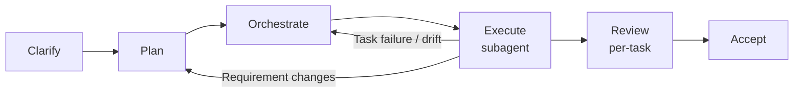

# Dev Flow Skills

[](https://www.npmjs.com/package/dev-flow-skills)
[](https://github.com/paulLee778899/dev-flow-skills/actions/workflows/ci.yml)
[](LICENSE)

**English** | [中文](README.zh-CN.md)

Governed development-flow skills for AI coding agents.

```text
clarify -> plan -> orchestrate -> execute (subagent) -> review -> accept
```

Dev Flow Skills turns `/dev-flow` into a disciplined software-delivery workflow. It is designed for agents that need to clarify requirements, maintain OpenSpec/opsx artifacts, build an executable task plan, coordinate TDD implementation via subagents with independent per-task review, handle Git safely, and finish with acceptance evidence instead of a chat-only summary. It also includes Loop Engineering commands for goal-preserving multi-round control, candidate discovery, safe handoff, and approved scheduler management.



## Why this exists

Most coding-agent failures are workflow failures:

- the agent starts coding before clarifying the requirement
- the agent writes plans but does not turn them into executable tasks
- execution stops after one task instead of continuing through the whole plan
- requirement changes are applied directly to code without updating docs and orchestration
- sub-agents fail or drift while the main agent reports success too early
- Git side effects happen without an explicit safety boundary

Dev Flow Skills adds gates, handoffs, runtime state, and final acceptance checks so the agent keeps moving without skipping the decisions that must remain user-owned.

The workflow reuses mature installed skills instead of copying every method into dev-flow. Superpowers workflows are called directly when available, while other installed or marketplace skills are treated as optional sources of good handling patterns.

## Quick start

### Recommended: install from npm

Install once and use `/dev-flow` in any project.

```bash
npm install -g dev-flow-skills
dev-flow install --global    # OpenCode
dev-flow install-codex       # Codex
dev-flow install-claude      # Claude Code
```

Update to the latest version:

```bash
npm install -g dev-flow-skills@latest
dev-flow update --global     # OpenCode
dev-flow update-codex        # Codex
dev-flow update-claude       # Claude Code
```

Check the install:

```bash
dev-flow doctor --global
```

### Alternative: install from GitHub

Use this if you want to test the repository version before an npm release:

```bash
git clone https://github.com/paulLee778899/dev-flow-skills.git
cd dev-flow-skills
npm install -g .
dev-flow install --global
```

When working from the cloned repo, `npm run update:all` updates all three platforms in one step.

### Optional: project-local install

Use this when a repository should pin and commit its workflow.

```bash
cd your-project
dev-flow install
```

Project-local installs write to `./.opencode/` and override global installs for that project.

### Install with an AI agent

Tell your coding agent:

```text
Fetch and follow the Dev Flow Skills agent installation instructions from:
https://raw.githubusercontent.com/paulLee778899/dev-flow-skills/main/install/agent-install.md

Install globally by default unless I explicitly ask for project-local installation.
Detect the current agent platform and follow the matching platform guide when one exists.
Do not overwrite modified local files unless I explicitly approve --force.
After installation, run the relevant doctor command and report exactly what changed.
```

For a longer prompt and platform-specific details, see [`install/agent-install.md`](install/agent-install.md).

## Platform guides

- OpenCode: [`install/opencode.md`](install/opencode.md)
- Codex: [`.codex/INSTALL.md`](.codex/INSTALL.md)
- Claude Code: [`install/claude.md`](install/claude.md)
- Agent installation: [`install/agent-install.md`](install/agent-install.md)
- Manual installation details: [`install/manual-install.md`](install/manual-install.md)

## Skill map

| Skill | Responsibility |
| --- | --- |
| `dev-flow-master` | Entry controller, final route selection, phase gates, and recovery signals |
| `dev-flow-intent` | Intent classification for debugging, feature, change-adjustment, review, UI/UX, status recovery, and questions |
| `dev-flow-debugging` | Root-cause-first debugging route and regression evidence |
| `dev-flow-ui-ux` | UI/UX route with browser, responsive, interaction, and visual verification expectations |
| `dev-flow-review` | Read-first review route with findings, risks, and test gaps |
| `dev-flow-planning` | Clarification before OpenSpec/opsx artifacts, checker subagent review, task DAG, detailed test matrix, and Git safety prep |
| `dev-flow-execution` | Subagent dispatch, per-task reviewer, continuous execution, dynamic replanning, and runtime state |
| `dev-flow-git` | Worktree, shared-working-tree, branch, PR, patch, rollback, and conflict safety |
| `dev-flow-loop` | Outer Loop Engineering control plane, safe handoff, and automation review |
| `dev-flow-loop-envelope` | Loop budget, permissions, cadence, stop conditions, and lock policy |
| `dev-flow-loop-triage` | Read-only candidate inbox from repo/CI/diff/OpenSpec/dev-flow evidence |
| `dev-flow-scheduler` | Approved cron/heartbeat automation creation, update, pause, resume, view, and deletion |
| `dev-flow-acceptance` | Final verification, quality evidence, and delivery report |
| `dev-flow-cr` | Independent user-triggered post-acceptance code review and CR report |

## Typical flow

```text
User: /dev-flow 给订单后台增加退款审批流，完整走 dev flow

Agent:
1. Enters `dev-flow-master`.
2. Loads `dev-flow-intent` and classifies the task type.
3. Routes debugging, UI/UX, and review requests to focused protocols when appropriate.
4. Classifies feature/change work as lightweight, medium, or heavyweight.
5. For lightweight work, uses opsx/OpenSpec artifacts such as `/opsx:ff`, `/opsx:apply`, and `/opsx:verify`.
6. Enters planning mode when governed planning is required.
7. Asks required clarification questions before writing or refreshing OpenSpec/opsx artifacts.
8. Writes requirement/design/task/test evidence into the active OpenSpec/opsx artifact set after user confirmation.
9. A checker subagent independently scores the baseline artifacts (score >= 95 required).
10. Builds task orchestration, parallel-safety rules, and an executable test matrix.
11. A checker subagent independently scores the orchestration plan (score >= 95 required).
12. Selects a Git strategy and shows the proposed execution actor at Phase 2 Gate.
13. Dispatches each implementation task to a sub-agent; the main agent coordinates only and does not edit files directly.
14. After each sub-agent reports final_success, a reviewer sub-agent independently verifies the diff and evidence before the task is settled.
15. Replans if requirements change or execution invalidates the plan.
16. Runs final acceptance with a checker subagent, writes delivery evidence.
17. Suggests user acceptance followed by optional `/dev-flow-cr`; CR is independent and not automatic.
```

## Loop Engineering

Loop Engineering is an outer control plane, not a `/dev-flow` phase.

- `/dev-flow-loop <goal>` preserves a goal across multiple dev-flow phases or repair rounds. It first gets Baseline Docs Gate approval for loop-only baseline artifacts: requirements, high-level design, detailed design, test plan (`test-plan.md`), and test case workbook (`test-cases.xlsx`) after a checker subagent records `checker_score >= 95`. These are outer-loop control artifacts, not `/dev-flow` implementation documents. Then it gets Execution Envelope Gate approval for the Loop Phase DAG, `auto_continue_scope`, `dev_flow_phase_handoff`, budgets, stop conditions, and side-effect boundaries. Only after both gates pass does it hand phases to dev-flow inside the approved envelope.
- `/dev-flow-triage` scans available evidence and builds a read-only Candidate Inbox.
- `/dev-flow-scheduler` creates, updates, views, pauses, resumes, or deletes approved cron/heartbeat automations; it does not scan candidates or design loop logic.
- Triage never writes code, commit, push, open PRs, create worktrees, mutate trackers, create schedulers, run `/dev-flow`, or run `/dev-flow-cr` automatically.
- A confirmed delivery loop may auto-continue within baseline by handing phase-level work to dev-flow; phase implementation still uses OpenSpec/opsx artifacts, task orchestration, TDD per task via superpowers when available, acceptance evidence, and `phase_eval` checkpoints. `phase_eval` is not `/dev-flow-cr` and must not emit `cr_report_ready`.
- Loop-owned artifacts live in `Docs/<topic>/loop/` or `docs/<topic>/loop/`. Phase OpenSpec/opsx originals stay in `openspec/changes/<change-id>/` or the project's standard OpenSpec/opsx location. Do not move or copy OpenSpec/opsx originals into the loop artifact directory; record phase mappings in `phase-artifacts.md` or `opsx-index.md`.
- Loop `phase_eval threshold: 95`; auto-continue requires `phase_eval_result.checker_score >= 95` and no P0/P1 finding.
- Freezing the initial baseline, approving the Loop Phase DAG, and enabling `within_confirmed_baseline` require explicit user approval; exceeding baseline, budget, retry, stop-condition, or side-effect boundaries requires stopping and asking the user.
- Machine-checkable loop terms: `loop_baseline_ready`, `checker_score`, `quality_threshold: 95`, `Baseline Docs Gate`, `Execution Envelope Gate`, `within_confirmed_baseline`, `phase-level OpenSpec/opsx`, and default max phase repair rounds of 3.
- If a candidate should be implemented or reviewed, the agent asks a concrete handoff question. After the user explicitly confirms a specific candidate, the agent may enter the equivalent `/dev-flow` or `/dev-flow-cr` owner flow without requiring another slash command.
- Recurring repo scans should use read-only Candidate Inbox prompts; automatic fixes and full code review stay off by default.

## Generated Artifacts

For implementation work, the flow uses the active project's OpenSpec schema as the durable implementation artifact set. Lightweight work keeps the artifact set small; medium/heavy work adds checker subagent review, DAG, detailed test matrix, Git safety, and system-level checks. Expected evidence includes:

- `openspec/changes/<change>/`
- generated proposal/tasks/spec/design artifacts required by the schema
- `/opsx:apply` implementation/task status
- `/opsx:verify` output
- Git/patch state and unresolved risk notes
- `dev-flow-state.md`
- `task-orchestration.md`
- runtime orchestration state
- `progress.md`
- `delivery-report.md`
- `cr-report.md` when the user later runs `/dev-flow-cr`

For `/dev-flow-loop` delivery loops only, loop baseline artifacts may include:

- `Docs/<topic>/loop/requirements.md`
- `Docs/<topic>/loop/high-level-design.md`
- `Docs/<topic>/loop/detailed-design.md`
- `Docs/<topic>/loop/test-plan.md`
- `Docs/<topic>/loop/test-cases.xlsx`
- `Docs/<topic>/loop/loop-phase-dag.md`
- `Docs/<topic>/loop/loop-envelope.md`
- `Docs/<topic>/loop/loop-state.md`
- `Docs/<topic>/loop/phase-artifacts.md` or `Docs/<topic>/loop/opsx-index.md`

Those loop artifacts preserve the outer goal and approved envelope. Phase implementation still uses OpenSpec/opsx originals in `openspec/changes/<change-id>/` or the active project's standard OpenSpec/opsx location.

Example layout:

```text
Docs/<topic>/
  loop/
    requirements.md
    high-level-design.md
    detailed-design.md
    test-plan.md
    test-cases.xlsx
    loop-phase-dag.md
    loop-envelope.md
    loop-state.md
    phase-artifacts.md
openspec/
  changes/
    <change-id>/
      proposal.md
      tasks.md
      specs/
```

The loop index links each phase to its OpenSpec/opsx change ID, canonical change path, status, verification evidence, and `phase_eval_result`.

## Skill layout

Core skills use progressive disclosure:

- `SKILL.md` keeps triggers, ownership, hard rules, and the shortest safe route.
- `references/` holds detailed contracts, signal tables, task schemas, recovery rules, and format examples that are loaded only when needed.
- `assets/baseline-templates/` under `dev-flow-loop` holds loop-only baseline templates for requirements, high-level design, detailed design, test plan, and the execution-level test case workbook. `/dev-flow` implementation planning does not load or require these templates.

This keeps frequently loaded skills small while preserving the full governance contract.

## Common commands

```bash
dev-flow install --global    # OpenCode
dev-flow install-codex       # Codex
dev-flow install-claude      # Claude Code
dev-flow update --global     # OpenCode
dev-flow update-codex        # Codex
dev-flow update-claude       # Claude Code
dev-flow doctor --global
dev-flow version
```

Doctor commands check required files, loop baseline template placement, the `/dev-flow`, `/dev-flow-cr`, `/dev-flow-loop`, and `/dev-flow-triage` commands, core `references/`, OpenSpec/opsx contract wording, checker gate phrases, Loop Engineering read-only boundaries, stale command-name drift, and core `.opencode/skills` mirror consistency.
Doctor commands also check `/dev-flow-scheduler`, approved automation boundaries, scheduler skill mirrors, and loop handoff wording.

## Safety model

- User confirmation is required before starting or refreshing OpenSpec/opsx artifacts when clarification is incomplete.
- Gate approvals and required signals are recorded in `dev-flow-state.md`; chat memory is not enough evidence for governed completion.
- All implementation work uses OpenSpec/opsx artifacts as the implementation baseline; if OpenSpec/opsx is unavailable, the workflow stops for user direction instead of silently doing chat-only or ad hoc planning.
- Phase 2 Gate shows the proposed execution actor before implementation starts; direct concurrent writers and worktree creation require explicit approval.
- Phase 3 implementation tasks are dispatched to sub-agents only; the main agent coordinates and does not directly edit code, test, or configuration files.
- Each implementing sub-agent's output is independently verified by a reviewer sub-agent before the task is settled. Critical or important findings trigger a fix-and-re-review cycle (max 3 rounds); unresolved critical findings block settlement until the user decides.
- Requirement changes during execution must return to planning before code changes continue.
- Shared working-tree writes must be serialized.
- Tasks with high file or symbol overlap must be serialized even when worktrees are available.
- Parallel no-worktree mode should use patch generation plus main-agent serial apply; a reviewer sub-agent verifies the applied diff before settling.
- All gate-impacting scores use an independent checker subagent with raw artifacts; the main agent does not self-score for gate passage. All gates (planning, loop, acceptance, completion) require checker score >= 95.
- Final acceptance requires task local verification evidence and canonical Git integration states for every task.
- Final acceptance requires TDD evidence for implementation tasks, system-level checks, requirements/design/test coverage, acceptance checker evidence, plus phase-level OpenSpec/opsx evidence for loop-authorized phases.
- Independent CR is user-triggered through `/dev-flow-cr` after the user accepts or inspects delivered work; it is not an automatic `/dev-flow` stage.
- Loop Engineering commands are read-only by default and may recommend `/dev-flow` or `/dev-flow-cr`; they only enter the equivalent owner flow after explicit confirmation of a specific candidate.
- Delivery loops may auto-continue only inside confirmed loop baseline artifacts and envelope limits; baseline changes, side-effect expansion, Git/PR/push/worktree actions, paid/external mutations, and unresolved P0/P1 deferrals require explicit user approval.
- Scheduler changes are isolated in `/dev-flow-scheduler` and require explicit approval for create/update/pause/resume/delete actions.
- Local modifications are protected by manifest checksums during update.
- Final success requires verification evidence, not only agent self-reporting.
