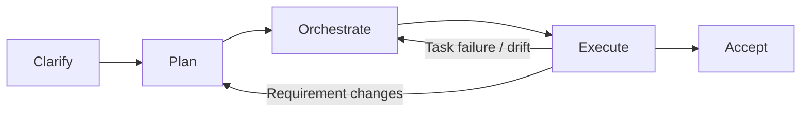

# Dev Flow Skills

[](https://www.npmjs.com/package/dev-flow-skills)
[](https://github.com/1Zihao/dev-flow-skills/actions/workflows/ci.yml)
[](LICENSE)

Governed development-flow skills for AI coding agents.

```text
clarify -> plan -> orchestrate -> execute -> accept
```

Dev Flow Skills turns `/dev-flow` into a disciplined software-delivery workflow. It is designed for agents that need to clarify requirements, write real planning documents, build an executable task plan, coordinate implementation, handle Git safely, and finish with acceptance evidence instead of a chat-only summary.



## Why this exists

Most coding-agent failures are workflow failures:

- the agent starts coding before clarifying the requirement
- the agent writes plans but does not turn them into executable tasks
- execution stops after one task instead of continuing through the whole plan
- requirement changes are applied directly to code without updating docs and orchestration
- sub-agents fail or drift while the main agent reports success too early
- Git side effects happen without an explicit safety boundary

Dev Flow Skills adds gates, handoffs, runtime state, and final acceptance checks so the agent keeps moving without skipping the decisions that must remain user-owned.

The workflow reuses mature installed skills instead of copying every method into dev-flow. Superpowers workflows are called directly when available, while other installed or marketplace skills are treated as optional sources of good handling patterns.

## Quick start

### Recommended: install from npm

Install once and use `/dev-flow` in any project.

```bash
npm install -g dev-flow-skills
dev-flow install --global
```

Update to the latest version:

```bash
npm install -g dev-flow-skills@latest
dev-flow update --global
```

Check the install:

```bash
dev-flow doctor --global
```

### Alternative: install from GitHub

Use this if you want to test the repository version before an npm release:

```bash
git clone https://github.com/1Zihao/dev-flow-skills.git
cd dev-flow-skills
npm install -g .
dev-flow install --global
```

### Optional: project-local install

Use this when a repository should pin and commit its workflow.

```bash
cd your-project
dev-flow install
```

Project-local installs write to `./.opencode/` and override global installs for that project.

### Install with an AI agent

Tell your coding agent:

```text
Fetch and follow the Dev Flow Skills agent installation instructions from:
https://raw.githubusercontent.com/1Zihao/dev-flow-skills/main/install/agent-install.md

Install globally by default unless I explicitly ask for project-local installation.
Detect the current agent platform and follow the matching platform guide when one exists.
Do not overwrite modified local files unless I explicitly approve --force.
After installation, run the relevant doctor command and report exactly what changed.
```

For a longer prompt and platform-specific details, see [`install/agent-install.md`](install/agent-install.md).

## Platform guides

- OpenCode: [`install/opencode.md`](install/opencode.md)
- Codex: [`.codex/INSTALL.md`](.codex/INSTALL.md)
- Agent installation: [`install/agent-install.md`](install/agent-install.md)
- Manual installation details: [`install/manual-install.md`](install/manual-install.md)

## Skill map

| Skill | Responsibility |
| --- | --- |
| `dev-flow-master` | Entry controller, final route selection, phase gates, and recovery signals |
| `dev-flow-intent` | Intent classification for debugging, feature, change-adjustment, review, UI/UX, status recovery, and questions |
| `dev-flow-debugging` | Root-cause-first debugging route and regression evidence |
| `dev-flow-ui-ux` | UI/UX route with browser, responsive, interaction, and visual verification expectations |
| `dev-flow-review` | Read-first review route with findings, risks, and test gaps |
| `dev-flow-planning` | Clarification before docs, formal planning docs, task DAG, and test matrix |
| `dev-flow-execution` | Continuous execution, task settlement, dynamic replanning, and runtime state |
| `dev-flow-git` | Worktree, shared-working-tree, branch, PR, patch, rollback, and conflict safety |
| `dev-flow-acceptance` | Final verification, quality evidence, and delivery report |

## Typical flow

```text
User: /dev-flow 给订单后台增加退款审批流，完整走 dev flow

Agent:
1. Enters `dev-flow-master`.
2. Loads `dev-flow-intent` and classifies the task type.
3. Routes debugging, UI/UX, and review requests to focused protocols when appropriate.
4. Classifies feature/change work as lightweight, medium, or heavyweight.
5. Enters planning mode when governed planning is required.
6. Asks required clarification questions before writing documents.
7. Writes requirement/design/test documents after user confirmation.
8. Builds task orchestration and an executable test matrix.
9. Selects a Git strategy.
10. Shows the default multi-agent/subagent execution mode at Phase 2 Gate, after orchestration and Git checks.
11. Executes continuously until all planned tasks settle.
12. Replans if requirements change or execution invalidates the plan.
13. Runs final acceptance and writes delivery evidence.
```

## Generated artifacts

For governed work, the flow is designed to produce durable project artifacts such as:

- `product-requirement-analysis.md`
- `software-requirement-analysis.md`
- `high-level-design.md`
- `detailed-design.md`
- `test-plan.md`
- `task-orchestration.md`
- runtime orchestration state
- `delivery-report.md`

Exact paths are project-specific and should be decided during planning.

## Common commands

```bash
dev-flow install --global
dev-flow update --global
dev-flow doctor --global
dev-flow version
```

Platform-specific commands are documented in the platform guides. Use `--dry-run` to preview file operations and `--force` to overwrite modified installed files intentionally.

## Safety model

- User confirmation is required before starting formal planning documents when clarification is incomplete.
- Phase 2 Gate shows the default multi-agent/subagent execution mode before implementation starts; users may override it to main-agent serial execution.
- Requirement changes during execution must return to planning before code changes continue.
- Shared working-tree writes must be serialized.
- Parallel no-worktree mode should use patch generation plus main-agent serial apply.
- Local modifications are protected by manifest checksums during update.
- Final success requires verification evidence, not only agent self-reporting.
