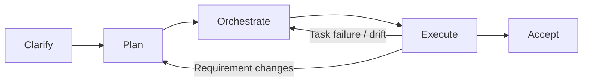

# Dev Flow Skills

[](https://www.npmjs.com/package/dev-flow-skills)
[](https://github.com/paulLee778899/dev-flow-skills/actions/workflows/ci.yml)
[](LICENSE)

Governed development-flow skills for AI coding agents.

```text
clarify -> plan -> orchestrate -> execute -> accept
```

Dev Flow Skills turns `/dev-flow` into a disciplined software-delivery workflow. It is designed for agents that need to clarify requirements, write real planning documents, build an executable task plan, coordinate implementation, handle Git safely, and finish with acceptance evidence instead of a chat-only summary. It also includes read-only Loop Engineering commands for candidate discovery, safe handoff, and approved scheduler management before any user-approved dev-flow execution starts.



## Why this exists

Most coding-agent failures are workflow failures:

- the agent starts coding before clarifying the requirement
- the agent writes plans but does not turn them into executable tasks
- execution stops after one task instead of continuing through the whole plan
- requirement changes are applied directly to code without updating docs and orchestration
- sub-agents fail or drift while the main agent reports success too early
- Git side effects happen without an explicit safety boundary

Dev Flow Skills adds gates, handoffs, runtime state, and final acceptance checks so the agent keeps moving without skipping the decisions that must remain user-owned.

The workflow reuses mature installed skills instead of copying every method into dev-flow. Superpowers workflows are called directly when available, while other installed or marketplace skills are treated as optional sources of good handling patterns.

## Quick start

### Recommended: install from npm

Install once and use `/dev-flow` in any project.

```bash
npm install -g dev-flow-skills
dev-flow install --global
```

Update to the latest version:

```bash
npm install -g dev-flow-skills@latest
dev-flow update --global
```

Check the install:

```bash
dev-flow doctor --global
```

### Alternative: install from GitHub

Use this if you want to test the repository version before an npm release:

```bash
git clone https://github.com/paulLee778899/dev-flow-skills.git
cd dev-flow-skills
npm install -g .
dev-flow install --global
```

### Optional: project-local install

Use this when a repository should pin and commit its workflow.

```bash
cd your-project
dev-flow install
```

Project-local installs write to `./.opencode/` and override global installs for that project.

### Install with an AI agent

Tell your coding agent:

```text
Fetch and follow the Dev Flow Skills agent installation instructions from:
https://raw.githubusercontent.com/paulLee778899/dev-flow-skills/main/install/agent-install.md

Install globally by default unless I explicitly ask for project-local installation.
Detect the current agent platform and follow the matching platform guide when one exists.
Do not overwrite modified local files unless I explicitly approve --force.
After installation, run the relevant doctor command and report exactly what changed.
```

For a longer prompt and platform-specific details, see [`install/agent-install.md`](install/agent-install.md).

## Platform guides

- OpenCode: [`install/opencode.md`](install/opencode.md)
- Codex: [`.codex/INSTALL.md`](.codex/INSTALL.md)
- Claude Code: [`install/claude.md`](install/claude.md)
- Agent installation: [`install/agent-install.md`](install/agent-install.md)
- Manual installation details: [`install/manual-install.md`](install/manual-install.md)

## Skill map

| Skill | Responsibility |
| --- | --- |
| `dev-flow-master` | Entry controller, final route selection, phase gates, and recovery signals |
| `dev-flow-intent` | Intent classification for debugging, feature, change-adjustment, review, UI/UX, status recovery, and questions |
| `dev-flow-debugging` | Root-cause-first debugging route and regression evidence |
| `dev-flow-ui-ux` | UI/UX route with browser, responsive, interaction, and visual verification expectations |
| `dev-flow-review` | Read-first review route with findings, risks, and test gaps |
| `dev-flow-planning` | Clarification before docs, formal planning docs, task DAG, and test matrix |
| `dev-flow-execution` | Continuous execution, task settlement, dynamic replanning, and runtime state |
| `dev-flow-git` | Worktree, shared-working-tree, branch, PR, patch, rollback, and conflict safety |
| `dev-flow-loop` | Outer Loop Engineering control plane, safe handoff, and automation review |
| `dev-flow-loop-envelope` | Loop budget, permissions, cadence, stop conditions, and lock policy |
| `dev-flow-loop-triage` | Read-only candidate inbox from repo/CI/diff/OpenSpec/dev-flow evidence |
| `dev-flow-scheduler` | Approved cron/heartbeat automation creation, update, pause, resume, view, and deletion |
| `dev-flow-acceptance` | Final verification, quality evidence, and delivery report |
| `dev-flow-cr` | Independent user-triggered post-acceptance code review and CR report |

## Typical flow

```text
User: /dev-flow 给订单后台增加退款审批流，完整走 dev flow

Agent:
1. Enters `dev-flow-master`.
2. Loads `dev-flow-intent` and classifies the task type.
3. Routes debugging, UI/UX, and review requests to focused protocols when appropriate.
4. Classifies feature/change work as lightweight, medium, or heavyweight.
5. For lightweight work, uses opsx/OpenSpec artifacts such as `/opsx:ff`, `/opsx:apply`, and `/opsx:verify`.
6. Enters planning mode when governed planning is required.
7. Asks required clarification questions before writing documents.
8. Writes requirement/design/test documents after user confirmation.
9. Builds task orchestration, parallel-safety rules, and an executable test matrix.
10. Selects a Git strategy.
11. Shows the proposed execution actor at Phase 2 Gate, after orchestration, overlap-risk, and Git checks.
12. Executes continuously until all planned tasks settle.
13. Replans if requirements change or execution invalidates the plan.
14. Runs final acceptance and writes delivery evidence.
15. Suggests user acceptance followed by optional `/dev-flow-cr`; CR is independent and not automatic.
```

## Loop Engineering

Loop Engineering is an outer control plane, not a `/dev-flow` phase.

- `/dev-flow-triage` scans available evidence and builds a read-only Candidate Inbox.
- `/dev-flow-loop` reviews loop design, envelope, budget, stop conditions, and safe handoff.
- `/dev-flow-scheduler` creates, updates, views, pauses, resumes, or deletes approved cron/heartbeat automations; it does not scan candidates or design loop logic.
- Loop and triage never write code, commit, push, open PRs, create worktrees, mutate trackers, create schedulers, run `/dev-flow`, or run `/dev-flow-cr` automatically.
- If a candidate should be implemented or reviewed, the agent asks a concrete handoff question. After the user explicitly confirms a specific candidate, the agent may enter the equivalent `/dev-flow` or `/dev-flow-cr` owner flow without requiring another slash command.
- Recurring repo scans should use read-only Candidate Inbox prompts; automatic fixes and full code review stay off by default.

## Generated artifacts

For governed work, the flow is designed to produce durable project artifacts such as:

- `product-requirement-analysis.md`
- `software-requirement-analysis.md`
- `high-level-design.md`
- `detailed-design.md`
- `test-plan.md`
- `dev-flow-state.md`
- `task-orchestration.md`
- runtime orchestration state
- `progress.md`
- `delivery-report.md`
- `cr-report.md` when the user later runs `/dev-flow-cr`

For lightweight work, the flow uses the active project's OpenSpec schema instead of the four dev-flow planning docs. Expected evidence includes:

- `openspec/changes/<change>/`
- generated proposal/tasks/spec/design artifacts required by the schema
- `/opsx:apply` implementation/task status
- `/opsx:verify` output
- Git/patch state and unresolved risk notes

Exact paths are project-specific and should be decided during planning.

## Skill layout

Core skills use progressive disclosure:

- `SKILL.md` keeps triggers, ownership, hard rules, and the shortest safe route.
- `references/` holds detailed contracts, signal tables, task schemas, recovery rules, and format examples that are loaded only when needed.
- `templates/` under `dev-flow-master` holds the governed planning document templates.

This keeps frequently loaded skills small while preserving the full governance contract.

## Common commands

```bash
dev-flow install --global
dev-flow update --global
dev-flow doctor --global
dev-flow version
```

Platform-specific commands are documented in the platform guides. Codex uses `install-codex` / `doctor-codex`; Claude Code uses `install-claude` / `doctor-claude`. Use `--dry-run` to preview file operations and `--force` to overwrite modified installed files intentionally.

Doctor commands check required files, planning templates, the `/dev-flow`, `/dev-flow-cr`, `/dev-flow-loop`, and `/dev-flow-triage` commands, core `references/`, lightweight opsx/OpenSpec contract wording, Loop Engineering read-only boundaries, stale command-name drift, and core `.opencode/skills` mirror consistency.
Doctor commands also check `/dev-flow-scheduler`, approved automation boundaries, scheduler skill mirrors, and loop handoff wording.

## Safety model

- User confirmation is required before starting formal planning documents when clarification is incomplete.
- Gate approvals and required signals are recorded in `dev-flow-state.md`; chat memory is not enough evidence for governed completion.
- Lightweight work uses opsx/OpenSpec artifacts instead of the four dev-flow planning docs; if opsx/OpenSpec is unavailable, the workflow stops for user direction instead of silently doing chat-only or ad hoc planning.
- Phase 2 Gate shows the proposed execution actor before implementation starts; direct concurrent writers and worktree creation require explicit approval.
- Requirement changes during execution must return to planning before code changes continue.
- Shared working-tree writes must be serialized.
- Tasks with high file or symbol overlap must be serialized even when worktrees are available.
- Parallel no-worktree mode should use patch generation plus main-agent serial apply.
- Final acceptance requires task self-review evidence and canonical Git integration states for every task.
- Independent CR is user-triggered through `/dev-flow-cr` after the user accepts or inspects delivered work; it is not an automatic `/dev-flow` stage.
- Loop Engineering commands are read-only by default and may recommend `/dev-flow` or `/dev-flow-cr`; they only enter the equivalent owner flow after explicit confirmation of a specific candidate.
- Scheduler changes are isolated in `/dev-flow-scheduler` and require explicit approval for create/update/pause/resume/delete actions.
- Local modifications are protected by manifest checksums during update.
- Final success requires verification evidence, not only agent self-reporting.
