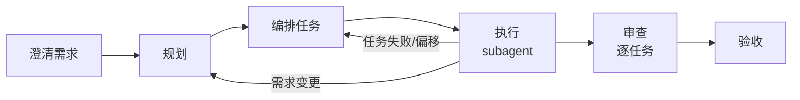

# Dev Flow Skills

[](https://www.npmjs.com/package/dev-flow-skills)
[](https://github.com/paulLee778899/dev-flow-skills/actions/workflows/ci.yml)
[](LICENSE)

[English](README.md) | **中文**

面向 AI 编程 Agent 的有治理约束的开发工作流 Skills。

```text
澄清需求 -> 规划 -> 编排任务 -> 执行（subagent）-> 审查 -> 验收
```

Dev Flow Skills 将 `/dev-flow` 变成一套有纪律的软件交付工作流。它面向需要以下能力的 Agent：澄清需求、维护 OpenSpec/opsx 制品、构建可执行任务计划、通过 subagent 协调 TDD 实现并对每个任务进行独立审查、安全操作 Git，以及用验收证据而非纯聊天摘要完成交付。它还包含 Loop Engineering 命令，用于目标保全的多轮控制、候选发现、安全移交和已审批调度管理。



## 为什么需要这个

大多数 AI 编程 Agent 的失败根源在于工作流问题：

- Agent 在没有澄清需求的情况下就开始写代码
- Agent 写了计划，却没有转化为可执行任务
- 完成一个任务后停止，而不是持续推进整个计划
- 需求变更直接应用到代码，没有更新文档和编排
- sub-agent 失败或偏离轨道，主 agent 却过早报告成功
- Git 操作产生副作用，没有明确的安全边界

Dev Flow Skills 添加了关卡、移交机制、运行时状态和最终验收检查，使 Agent 在不跳过必须由用户决策的环节的前提下保持推进。

本工作流复用成熟的已安装 Skills，而不是将每个方法都复制到 dev-flow 中。Superpowers 工作流在可用时直接调用，其他已安装或市场 Skills 则作为可选的优良处理模式来源。

## 快速开始

### 推荐：通过 npm 安装

安装一次，在任意项目中使用 `/dev-flow`。

```bash
npm install -g dev-flow-skills
dev-flow install --global    # OpenCode
dev-flow install-codex       # Codex
dev-flow install-claude      # Claude Code
```

更新到最新版本：

```bash
npm install -g dev-flow-skills@latest
dev-flow update --global     # OpenCode
dev-flow update-codex        # Codex
dev-flow update-claude       # Claude Code
```

验证安装：

```bash
dev-flow doctor --global
```

### 备选：从 GitHub 安装

适合在 npm 发布前测试仓库版本：

```bash
git clone https://github.com/paulLee778899/dev-flow-skills.git
cd dev-flow-skills
npm install -g .
dev-flow install --global
```

从克隆仓库工作时，`npm run update:all` 可一步更新三个平台。

### 可选：项目本地安装

适合需要在仓库中固定并提交工作流的场景。

```bash
cd your-project
dev-flow install
```

项目本地安装写入 `./.opencode/`，并覆盖该项目的全局安装。

### 通过 AI Agent 安装

告诉你的编程 Agent：

```text
获取并遵循以下 Dev Flow Skills Agent 安装指南：
https://raw.githubusercontent.com/paulLee778899/dev-flow-skills/main/install/agent-install.md

除非我明确要求项目本地安装，否则默认全局安装。
检测当前 Agent 平台，并在存在对应平台指南时遵循该指南。
除非我明确批准 --force，否则不要覆盖已修改的本地文件。
安装完成后，运行相关 doctor 命令并报告具体变更内容。
```

更长的提示词和平台特定细节，见 [`install/agent-install.md`](install/agent-install.md)。

## 平台指南

- OpenCode：[`install/opencode.md`](install/opencode.md)
- Codex：[`.codex/INSTALL.md`](.codex/INSTALL.md)
- Claude Code：[`install/claude.md`](install/claude.md)
- Agent 安装：[`install/agent-install.md`](install/agent-install.md)
- 手动安装详情：[`install/manual-install.md`](install/manual-install.md)

## Skill 说明

| Skill | 职责 |
| --- | --- |
| `dev-flow-master` | 入口控制器、最终路由选择、阶段关卡、恢复信号 |
| `dev-flow-intent` | 意图分类：调试、功能开发、变更调整、代码审查、UI/UX、状态恢复、问答 |
| `dev-flow-debugging` | 根因优先的调试路由和回归证据 |
| `dev-flow-ui-ux` | UI/UX 路由，含浏览器、响应式、交互和视觉验证预期 |
| `dev-flow-review` | 读代码优先的审查路由，输出发现、风险和测试盲区 |
| `dev-flow-planning` | 编写 OpenSpec/opsx 制品前的澄清、checker subagent 审查、任务 DAG、详细测试矩阵和 Git 安全准备 |
| `dev-flow-execution` | Subagent 调度、逐任务审查（reviewer）、持续执行、动态重规划、运行时状态 |
| `dev-flow-git` | Worktree、共享工作树、分支、PR、补丁、回滚和冲突安全 |
| `dev-flow-loop` | 外层 Loop Engineering 控制平面、安全移交、自动化审查 |
| `dev-flow-loop-envelope` | Loop 预算、权限、节奏、停止条件、锁定策略 |
| `dev-flow-loop-triage` | 从仓库/CI/diff/OpenSpec/dev-flow 证据生成只读候选列表 |
| `dev-flow-scheduler` | 已审批 cron/心跳自动化的创建、更新、暂停、恢复、查看和删除 |
| `dev-flow-acceptance` | 最终验证、质量证据和交付报告 |
| `dev-flow-cr` | 用户触发的独立验收后代码审查及 CR 报告 |

## 典型流程

```text
用户：/dev-flow 给订单后台增加退款审批流，完整走 dev flow

Agent：
1. 进入 `dev-flow-master`。
2. 加载 `dev-flow-intent`，对任务类型进行分类。
3. 对调试、UI/UX 和审查类请求路由到对应的专项协议。
4. 将功能/变更工作分类为轻量、中等或重型。
5. 轻量工作使用 opsx/OpenSpec 制品，如 `/opsx:ff`、`/opsx:apply`、`/opsx:verify`。
6. 需要治理规划时进入规划模式。
7. 在写入或刷新 OpenSpec/opsx 制品前，提出必要的澄清问题。
8. 用户确认后，将需求/设计/任务/测试证据写入当前活跃的 OpenSpec/opsx 制品集。
9. Checker subagent 独立对基线制品打分（要求 >= 95）。
10. 构建任务编排、并行安全规则和可执行测试矩阵。
11. Checker subagent 独立对编排计划打分（要求 >= 95）。
12. 选择 Git 策略，在第二阶段关卡展示拟定的执行主体。
13. 将每个实现任务派发给 sub-agent；主 agent 仅负责协调，不直接编辑文件。
14. 每个 sub-agent 报告 final_success 后，reviewer sub-agent 独立验证 diff 和证据，通过后任务才算结算。
15. 若需求变更或执行使计划失效，则重新规划。
16. 通过 checker subagent 进行最终验收，写入交付证据。
17. 建议用户确认验收，并可选择执行 `/dev-flow-cr`；CR 独立运行，不自动触发。
```

## Loop Engineering

Loop Engineering 是外层控制平面，不是 `/dev-flow` 的阶段。

- `/dev-flow-loop <目标>` 跨多个 dev-flow 阶段或修复轮次保全目标。它首先通过 Baseline Docs Gate，对 loop 专属基线制品（需求、高层设计、详细设计、测试计划 `test-plan.md`、测试用例工作簿 `test-cases.xlsx`）进行审批，要求 checker subagent 记录 `checker_score >= 95`。这些是外层 loop 控制制品，不是 `/dev-flow` 实现文档。然后通过 Execution Envelope Gate，审批 Loop Phase DAG、`auto_continue_scope`、`dev_flow_phase_handoff`、预算、停止条件和副作用边界。两个关卡都通过后，才在已审批的执行边界内将阶段移交给 dev-flow。
- `/dev-flow-triage` 扫描可用证据，构建只读候选列表（Candidate Inbox）。
- `/dev-flow-scheduler` 创建、更新、查看、暂停、恢复或删除已审批的 cron/心跳自动化；它不扫描候选列表，也不设计 loop 逻辑。
- Triage 从不自动执行写代码、提交、推送、开 PR、创建 worktree、修改追踪器、创建调度器、运行 `/dev-flow` 或 `/dev-flow-cr` 等操作。
- 已确认的交付 loop 可在基线范围内自动继续，将阶段级工作移交给 dev-flow；阶段实现仍需使用 OpenSpec/opsx 制品、任务编排、每任务 TDD（在 superpowers 可用时）、验收证据和 `phase_eval` 检查点。`phase_eval` 不是 `/dev-flow-cr`，不得输出 `cr_report_ready`。
- Loop 专属制品存放在 `Docs/<topic>/loop/` 或 `docs/<topic>/loop/`。阶段 OpenSpec/opsx 原件留在 `openspec/changes/<change-id>/` 或项目标准 OpenSpec/opsx 位置。不要将 OpenSpec/opsx 原件移入或复制到 loop 制品目录；在 `phase-artifacts.md` 或 `opsx-index.md` 中记录阶段映射关系。
- Loop `phase_eval threshold: 95`；自动继续要求 `phase_eval_result.checker_score >= 95` 且无 P0/P1 发现。
- 冻结初始基线、审批 Loop Phase DAG 和启用 `within_confirmed_baseline` 均需用户明确批准；超出基线、预算、重试、停止条件或副作用边界时，必须停下来询问用户。
- 可机器检查的 loop 术语：`loop_baseline_ready`、`checker_score`、`quality_threshold: 95`、`Baseline Docs Gate`、`Execution Envelope Gate`、`within_confirmed_baseline`、`phase-level OpenSpec/opsx`，以及默认最大阶段修复轮次 3。
- 若某个候选应被实现或审查，Agent 需提出具体的移交询问。用户明确确认特定候选后，Agent 可进入对应的 `/dev-flow` 或 `/dev-flow-cr` 流程，无需用户再次输入 slash 命令。
- 周期性仓库扫描应使用只读候选列表提示；自动修复和完整代码审查默认关闭。

## 生成的制品

对于实现工作，工作流以当前项目的 OpenSpec schema 作为持久化实现制品集。轻量工作保持制品集精简；中重型工作增加 checker subagent 审查、DAG、详细测试矩阵、Git 安全和系统级检查。预期证据包括：

- `openspec/changes/<change>/`
- schema 要求的 proposal/tasks/spec/design 制品
- `/opsx:apply` 实现/任务状态
- `/opsx:verify` 输出
- Git/补丁状态和未解决的风险备注
- `dev-flow-state.md`
- `task-orchestration.md`
- 运行时编排状态
- `progress.md`
- `delivery-report.md`
- 用户后续执行 `/dev-flow-cr` 时生成的 `cr-report.md`

仅限 `/dev-flow-loop` 交付 loop，loop 基线制品可包括：

- `Docs/<topic>/loop/requirements.md`
- `Docs/<topic>/loop/high-level-design.md`
- `Docs/<topic>/loop/detailed-design.md`
- `Docs/<topic>/loop/test-plan.md`
- `Docs/<topic>/loop/test-cases.xlsx`
- `Docs/<topic>/loop/loop-phase-dag.md`
- `Docs/<topic>/loop/loop-envelope.md`
- `Docs/<topic>/loop/loop-state.md`
- `Docs/<topic>/loop/phase-artifacts.md` 或 `Docs/<topic>/loop/opsx-index.md`

这些 loop 制品保全外层目标和已审批的执行边界。阶段实现仍使用 `openspec/changes/<change-id>/` 或项目标准 OpenSpec/opsx 位置中的原件。

目录示例：

```text
Docs/<topic>/
  loop/
    requirements.md
    high-level-design.md
    detailed-design.md
    test-plan.md
    test-cases.xlsx
    loop-phase-dag.md
    loop-envelope.md
    loop-state.md
    phase-artifacts.md
openspec/
  changes/
    <change-id>/
      proposal.md
      tasks.md
      specs/
```

loop 索引将每个阶段与其 OpenSpec/opsx change ID、规范变更路径、状态、验证证据和 `phase_eval_result` 关联。

## Skill 结构

核心 Skills 采用渐进式披露结构：

- `SKILL.md` 保存触发条件、归属、强制规则和最短安全路由。
- `references/` 保存详细合约、信号表、任务 schema、恢复规则和格式示例，仅在需要时加载。
- `dev-flow-loop` 下的 `assets/baseline-templates/` 存放 loop 专属基线模板（需求、高层设计、详细设计、测试计划和执行级测试用例工作簿）。`/dev-flow` 实现规划不加载或依赖这些模板。

这使得频繁加载的 Skills 保持精简，同时保留完整的治理合约。

## 常用命令

```bash
dev-flow install --global    # OpenCode
dev-flow install-codex       # Codex
dev-flow install-claude      # Claude Code
dev-flow update --global     # OpenCode
dev-flow update-codex        # Codex
dev-flow update-claude       # Claude Code
dev-flow doctor --global
dev-flow version
```

Doctor 命令检查：必需文件、loop 基线模板位置、`/dev-flow`、`/dev-flow-cr`、`/dev-flow-loop`、`/dev-flow-triage` 命令、核心 `references/`、OpenSpec/opsx 合约措辞、checker 关卡短语、Loop Engineering 只读边界、过时命令名漂移，以及核心 `.opencode/skills` 镜像一致性。
Doctor 命令还检查：`/dev-flow-scheduler`、已审批的自动化边界、调度器 skill 镜像和 loop 移交措辞。

## 安全模型

- 在澄清不完整时，启动或刷新 OpenSpec/opsx 制品前需用户确认。
- 关卡审批和必需信号记录在 `dev-flow-state.md`；聊天记忆不足以作为受治理完成的证据。
- 所有实现工作以 OpenSpec/opsx 制品作为实现基线；若 OpenSpec/opsx 不可用，工作流停下来等待用户指示，而不是默默进行纯聊天式或临时规划。
- 第二阶段关卡在实现开始前展示拟定的执行主体；直接并发写入和 worktree 创建需明确批准。
- 第三阶段所有实现任务仅通过 sub-agent 执行；主 agent 只负责协调，不直接编辑代码、测试或配置文件。
- 每个实现 sub-agent 的输出在结算前都由 reviewer sub-agent 独立验证。关键或重要发现触发修复-重审循环（最多 3 轮）；未解决的关键发现阻止结算，直到用户决策。
- 执行期间的需求变更必须返回规划阶段才能继续修改代码。
- 共享工作树写入必须串行化。
- 高文件或符号重叠的任务即使有 worktree 也必须串行执行。
- 无 worktree 并行模式应使用补丁生成加主 agent 串行应用；reviewer sub-agent 在结算前验证已应用的 diff。
- 所有影响关卡的评分使用对原始制品进行审查的独立 checker subagent；主 agent 不能为关卡通过进行自我评分。所有关卡（规划、loop、验收、完成）均要求 checker 分数 >= 95。
- 最终验收要求每个任务的本地验证证据和规范 Git 集成状态。
- 最终验收要求实现任务的 TDD 证据、系统级检查、需求/设计/测试覆盖率、验收 checker 证据，以及 loop 授权阶段的阶段级 OpenSpec/opsx 证据。
- 独立 CR 由用户在接受或检查交付工作后通过 `/dev-flow-cr` 触发；它不是 `/dev-flow` 的自动阶段。
- Loop Engineering 命令默认只读，可建议执行 `/dev-flow` 或 `/dev-flow-cr`；仅在用户明确确认特定候选后才进入对应的 owner 流程。
- 交付 loop 只能在已确认的 loop 基线制品和执行边界内自动继续；基线变更、副作用扩展、Git/PR/推送/worktree 操作、付费/外部变更和未解决的 P0/P1 推迟项均需用户明确批准。
- 调度器变更隔离在 `/dev-flow-scheduler` 中，创建/更新/暂停/恢复/删除操作均需明确批准。
- 本地修改在更新期间受清单校验和保护。
- 最终成功需要验证证据，而非仅凭 agent 自我报告。
